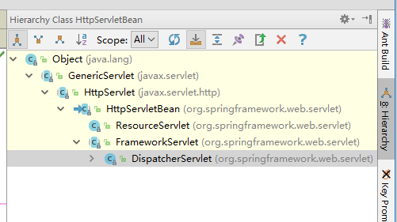

参考

https://blog.csdn.net/h3243212/article/details/51016271

处理流程

 

各个Servlet的作用：

**1. HttpServletBean**

　　**主要做一些初始化的工作，将web.xml中配置的参数设置到Servlet中。比如servlet标签的子标签init-param标签中配置的参数。**

**2. FrameworkServlet**

　　**将Servlet与Spring容器上下文关联。其实也就是初始化FrameworkServlet的属性webApplicationContext，这个属性代表SpringMVC上下文，它有个父类上下文，既web.xml中配置的ContextLoaderListener监听器初始化的容器上下文。**

**3. DispatcherServlet** 

　　**初始化各个功能的实现类。比如异常处理、视图处理、请求映射处理等。**

