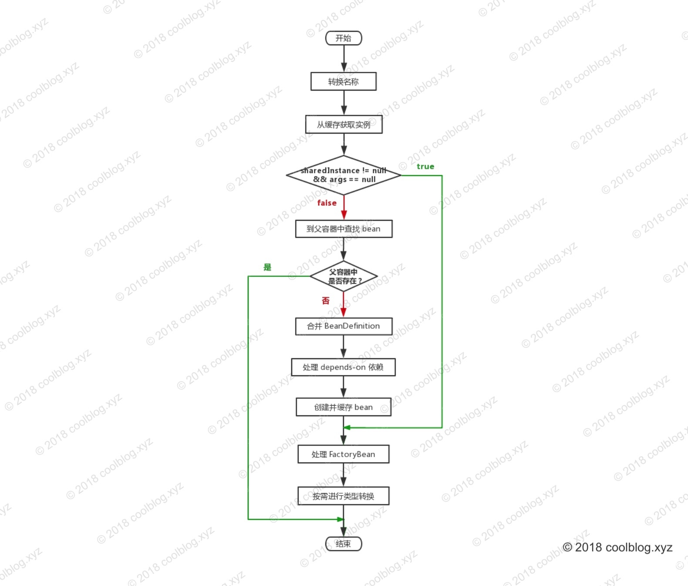

http://www.tianxiaobo.com/2018/06/01/Spring-IOC-%E5%AE%B9%E5%99%A8%E6%BA%90%E7%A0%81%E5%88%86%E6%9E%90-%E8%8E%B7%E5%8F%96%E5%8D%95%E4%BE%8B-bean/


## 获取单例bean

doGetBean()

```markdown
转换 beanName
从缓存中获取实例
如果实例不为空，且 args = null。调用 getObjectForBeanInstance 方法，并按 name 规则返回相应的 bean 实例
若上面的条件不成立，则到父容器中查找 beanName 对有的 bean 实例，存在则直接返回
若父容器中不存在，则进行下一步操作 – 合并 BeanDefinition
处理 depends-on 依赖
创建并缓存 bean
调用 getObjectForBeanInstance 方法，并按 name 规则返回相应的 bean 实例
按需转换 bean 类型，并返回转换后的 bean 实例。
```

 

