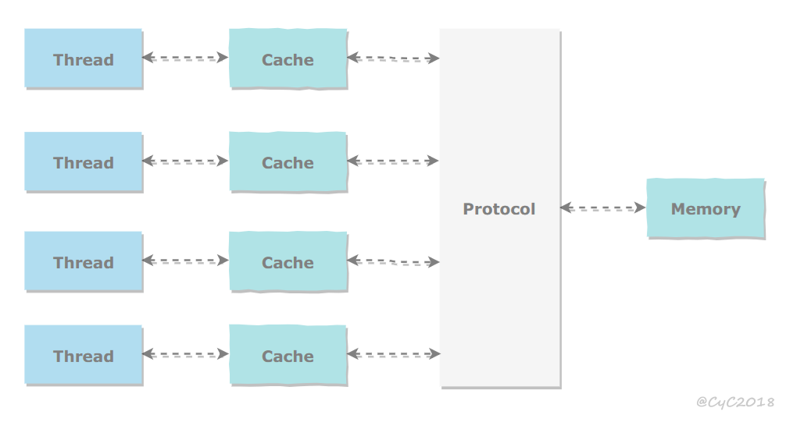
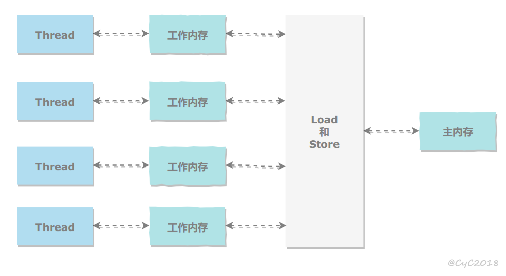
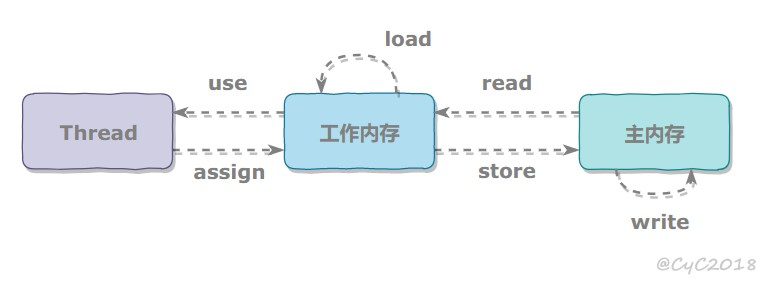

Java内存模型

处理器寄存器—>高速缓存(解决速度量级差异引入)—>缓存协议(解决缓存一致性问题引入)—>内存

所有的变量都存储在主内存中

每个线程都有自己的工作内存

线程之间的变量传递通过主内存完成

8个操作

- read 从主内存中读取变量值到工作内存
- load 紧接read把值放入工作内存的变量副本
- use 传递变量值给执行引擎
- assign 执行引擎赋值后传递值到工作内存的变量副本
- store 工作内存的变量值传递给主内存
- write 紧接着store，把变量值存入主内存

- lock/unlock 作用于主内存的变量

3大特性

原子

read、load、use、assign、store、write、lock 和 unlock 操作具有原子性

Java 内存模型允许虚拟机将没有被 volatile 修饰的 64 位数据（long，double）的读写操作划分为两次 32 位的操作来进行，即 load、store、read 和 write 操作可以不具备原子性

AtomicInteger 能保证多个线程修改的原子性

synchronized 互斥锁来保证操作的原子性。它对应的内存间交互操作为：lock 和 unlock，在虚拟机实现上对应的字节码指令为 monitorenter 和 monitorexit

可见

一个线程修改了共享变量的值，其它线程能够立即得知这个修改

- volatile
- synchronized，对一个变量执行 unlock 操作之前，必须把变量值同步回主内存。
- final，被 final 关键字修饰的字段在构造器中一旦初始化完成，并且没有发生 this 逃逸（其它线程通过 this 引用访问到初始化了一半的对象），那么其它线程就能看见 final 字段的值。

有序

允许编译器和处理器对指令进行重排序，重排序过程不会影响到单线程程序的执行，却会影响到多线程并发执行的正确性

volatile 关键字通过添加内存屏障的方式来禁止指令重排，即重排序时不能把后面的指令放到内存屏障之前

通过 synchronized 来保证有序性，它保证每个时刻只有一个线程执行同步代码，相当于是让线程顺序执行同步代码

