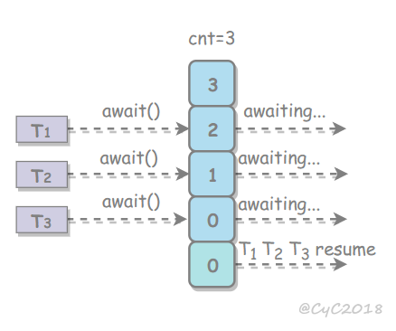

https://github.com/CyC2018/CS-Notes/blob/master/docs/notes/Java%20%E5%B9%B6%E5%8F%91.md#%E4%B8%80%E7%BA%BF%E7%A8%8B%E7%8A%B6%E6%80%81%E8%BD%AC%E6%8D%A2


https://www.cnblogs.com/dolphin0520/p/3920397.html


CountDownLatch

一个线程等待多个线程 

 

```java
public class CountDownLatchTest {
    //维护了一个计数器 cnt，每次调用 countDown() 方法会让计数器的值减 1，减到 0 的时候，那些因为调用 await() 方法而在等待的线程就会被唤醒
    public static void main(String[] args) {
        CountDownLatch count = new CountDownLatch(10);
        ExecutorService es = Executors.newCachedThreadPool();
        es.execute(()->{
            try {
                count.await();
                System.out.printf("before");
            } catch (InterruptedException e) {
                e.printStackTrace();
            }
        });
        for (int i = 0; i < 10; i++) {
            es.execute(()->{
                System.out.println("run...");
                count.countDown();
            });
        }
        es.shutdown();
    }
}
```

CyclicBarrier

多个线程互相等待，只有当多个线程都到达时，这些线程才会继续执行




```java
import java.util.concurrent.*;

public class CyclicBarrierTest {
    //CyclicBarrier 循环屏障
    //线程执行 await() 方法之后计数器会减 1，并进行等待，直到计数器为 0，所有调用 await() 方法而在等待的线程才能继续执行
    //调用 reset() 方法可以循环使用
    public static void main(String[] args) {
        CyclicBarrier barrier = new CyclicBarrier(3);
        ExecutorService es = Executors.newCachedThreadPool();
        for (int i = 0; i < 3; i++) {
            es.execute(()->{
                System.out.println("before");
                int await = 0;
                try {
                    await = barrier.await();//在这里等待，每次调用计数器减一，到0时所有线程继续执行
                    System.out.println(await);
                } catch (InterruptedException e) {
                    e.printStackTrace();
                } catch (BrokenBarrierException e) {
                    e.printStackTrace();
                }
                System.out.println("after");//继续执行
            });
        }

        MyRun myRun = new MyRun();
        CyclicBarrier barrier1 = new CyclicBarrier(3, myRun);
        for (int i = 0; i < 3; i++) {
            new Thread(()->{
                System.out.println("before");
                try {
                    int await = barrier1.await();
                    System.out.println(await);
                } catch (InterruptedException e) {
                    e.printStackTrace();
                } catch (BrokenBarrierException e) {
                    e.printStackTrace();
                }
            }).start();//到达内存屏障之后 最后一个线程会在执行一下传入的这个任务
        }
    }
    private static class MyRun implements Runnable {

        @Override
        public void run() {
            System.out.println("MyRun...");
        }
    }
}

```

Semaphore

控制对互斥资源的访问线程数

```java
public class SemaphoreTest {
    public static void main(String[] args) {
        Semaphore s = new Semaphore(3);
        ExecutorService es = Executors.newCachedThreadPool();
        for (int i = 0; i < 10; i++) {
            es.execute(()->{
                try {
                    s.acquire();
                    System.out.println("available: " + s.availablePermits());
                } catch (InterruptedException e) {
                    e.printStackTrace();
                } finally {
                    s.release();
                }
            });
        }
        es.shutdown();
    }
}
```


ForkJoin


```java
public class ForkJoinTest extends RecursiveTask<Integer> {
    //把大的计算任务拆分成多个小任务并行计算
    //工作窃取算法
    //每个线程都维护了一个双端队列，用来存储需要执行的任务
    //允许空闲的线程从其它线程的双端队列中窃取一个任务来执行。窃取的任务必须是最晚的任务，避免和队列所属线程发生竞争
    //如果队列中只有一个任务时还是会发生竞争
    private final int threshold = 5;
    private int first;
    private int last;

    public ForkJoinTest(int first, int last) {
        this.first = first;
        this.last = last;
    }

    @Override
    protected Integer compute() {
        int result = 0;
        if (last - first <= threshold) {
            // 任务足够小则直接计算
            for (int i = first; i <= last; i++) {
                result += i;
            }
        } else {
            // 拆分成小任务
            int middle = first + (last - first) / 2;
            ForkJoinTest leftTask = new ForkJoinTest(first, middle);
            ForkJoinTest rightTask = new ForkJoinTest(middle + 1, last);
            leftTask.fork();
            rightTask.fork();
            result = leftTask.join() + rightTask.join();
        }
        return result;
    }
    public static void main(String[] args) throws ExecutionException, InterruptedException {
        ForkJoinTest example = new ForkJoinTest(1, 10000);
        ForkJoinPool forkJoinPool = new ForkJoinPool();//线程数量取决于 CPU 核数
        Future result = forkJoinPool.submit(example);
        System.out.println(result.get());
    }
}
```


