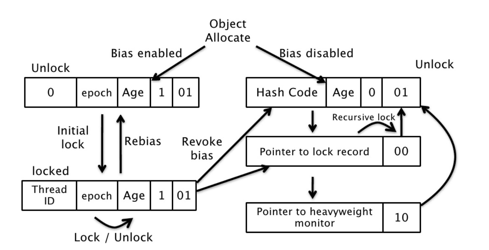

synchronized 的优化

自旋锁

锁消除

锁粗化

轻量级锁

无锁状态（unlocked）、偏向锁状态（biasble）、轻量级锁状态（lightweight locked）和重量级锁状态（inflated）

HotSpot 虚拟机对象头

线程的虚拟机栈

使用 CAS 操作

如果有两条以上的线程争用同一个锁，那轻量级锁就不再有效，要膨胀为重量级锁

偏向锁

偏向锁的思想是偏向于让第一个获取锁对象的线程，这个线程在之后获取该锁就不再需要进行同步操作，甚至连 CAS 操作也不再需要

