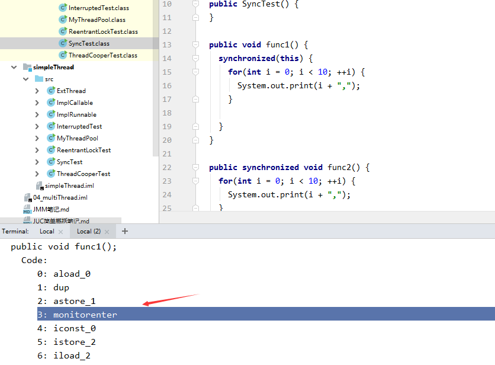
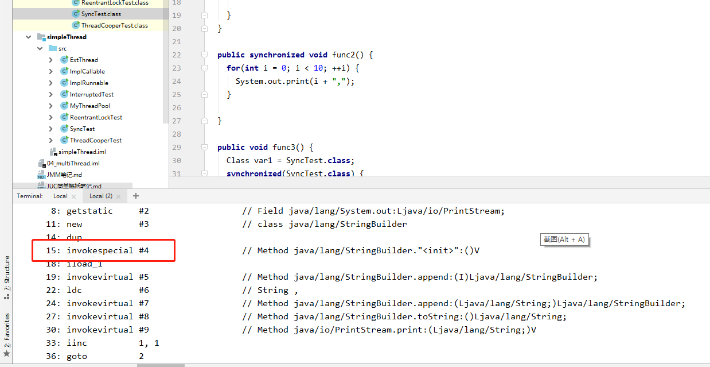

在编译之后在同步方法调用前加入一个 `monitor.enter` 指令，在退出方法和异常处插入 `monitor.exit` 的指令 

```shell
javap -c SyncTest
```





 




同步方法


在VM字节码层面并没有任何特别的指令来实现被synchronized修饰的方法，而是在Class文件的方法表中将该方法的accessflags字段中的synchronized标志位置1，表示该方法是同步方法并使用调用该方法的对象或该方法所属的Class在JVM的内部对象表示Klass做为锁对象。 


https://github.com/crossoverJie/JCSprout/blob/master/MD/Synchronize.md

