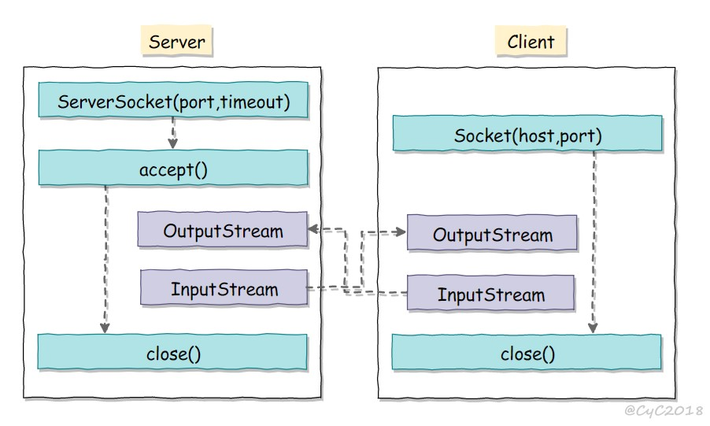

参考

https://github.com/CyC2018/CS-Notes/blob/master/notes/Java%20IO.md

```java
磁盘操作：File
字节操作：InputStream 和 OutputStream
字符操作：Reader 和 Writer
对象操作：Serializable
网络操作：Socket
新的输入/输出：NIO
```


InputStream的装饰者模式

- InputStream 是抽象组件；
- FileInputStream 是 InputStream 的子类，属于具体组件，提供了字节流的输入操作；
- FilterInputStream 属于抽象装饰者，装饰者用于装饰组件，为组件提供额外的功能。例如 BufferedInputStream 为 FileInputStream 提供缓存的功能。


```java
protected FilterInputStream(InputStream in) {
        this.in = in;
    }
```


Socket




