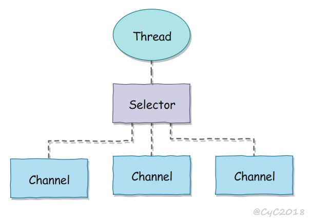

jdk1.4

使用块传输

java.io.* 已经以 NIO 为基础重新实现


通道

Channel

双向的，可以用于读、写或者同时用于读写

```java
FileChannel：从文件中读写数据；
DatagramChannel：通过 UDP 读写网络中数据；
SocketChannel：通过 TCP 读写网络中数据；
ServerSocketChannel：可以监听新进来的 TCP 连接，对每一个新进来的连接都会创建一个 SocketChannel
```


缓冲区

不会直接对通道进行读写数据，而是要先经过缓冲区

数组

可以跟踪系统的读/写进程

```java
ByteBuffer
CharBuffer
ShortBuffer
IntBuffer
LongBuffer
FloatBuffer
DoubleBuffer
```

状态变量

```java
capacity：最大容量；
position：当前已经读写的字节数；
limit：还可以读写的字节数
```


Capacity = 8

Position=0

Limit=8


Read 5 bytes

Position=5

Limit=8


Flip() -> to change to write mode


Position=0

limit=5


Read 4 bytes

Position=4

limit=5


Clear() -> to change to read mode

Position=0

limit=8


选择器




