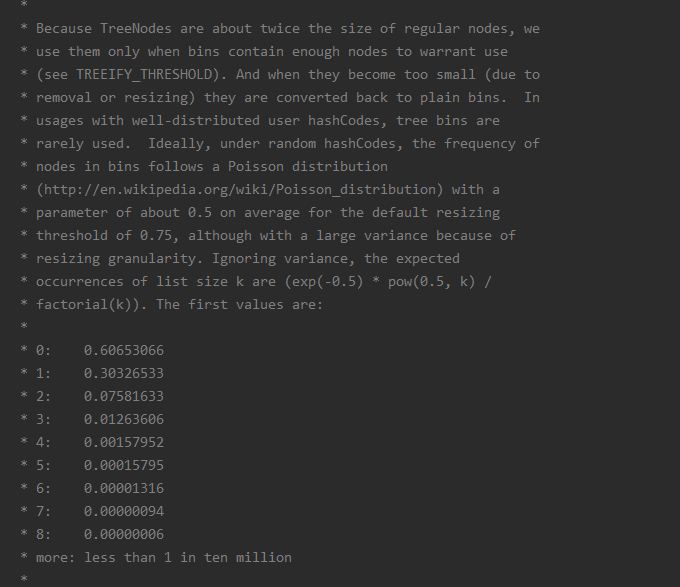

hashmap

1.7

key->hashcode->hash

位置：(n-1)&hash n为数组长度

```java
static int hash(int h) {
    // This function ensures that hashCodes that differ only by
    // constant multiples at each bit position have a bounded
    // number of collisions (approximately 8 at default load factor).

    h ^= (h >>> 20) ^ (h >>> 12);
    return h ^ (h >>> 7) ^ (h >>> 4);
}
```


1.8

```java
static final int hash(Object key) {
        int h;
        // key.hashCode()：返回散列值也就是hashcode
        // ^ ：按位异或
        // >>>:无符号右移，忽略符号位，空位都以0补齐
        return (key == null) ? 0 : (h = key.hashCode()) ^ (h >>> 16);
}
```


为什么链表长度是8就转成红黑树




HashMap1.8中多线程扩容引起的丢失数据问题

https://blog.csdn.net/Hzt_fighting_up/article/details/78737468


图

1.8

 


 ConcurrentHashMap 

1.7

 

1.8

 

JDK1.8的优化

https://www.jianshu.com/p/800aa1cf5c13

源码分析，有图，比较清楚

https://www.cnblogs.com/xiaoxi/p/7233201.html

