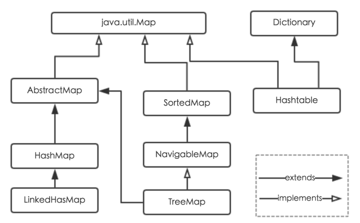

1.7

底层

数组+链表


拉链法


几个参数

```shell
//默认初始化桶的数目
static final int DEFAULT_INITIAL_CAPACITY = 16;
//最大桶的数目
static final int MAXIMUM_CAPACITY = 1 << 30;
//默认的loadFactor
static final float DEFAULT_LOAD_FACTOR = 0.75f;
//存储结构
transient Entry[] table;
//键值对数量
transient int size;
//size的临界值
int threshold;
//负载因子，table能被使用的比例，threshold = capacity*loadFactor
final float loadFactor;

```

存储结构

```shell
Entry[K,V][] table

->

value 值
next 链表
key 键
hash key的hashcode

```

transient修饰，只序列化有数据的部分


方法

```shell
//存入一个键值对
put(key,value)
1. 数组是否为空，是的话，初始化hashmap
2. key是否为空，-> putforNullKey(value)，放到编号为0的桶下

```


参考资料

https://crossoverjie.top/2018/07/23/java-senior/ConcurrentHashMap/

https://github.com/CyC2018/CS-Notes/blob/master/docs/notes/Java%20%E5%AE%B9%E5%99%A8.md#hashmap

https://zhuanlan.zhihu.com/p/21673805


