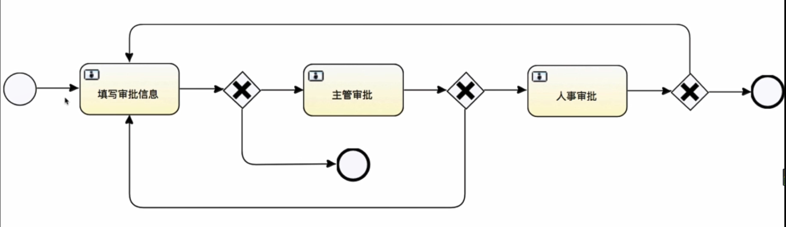
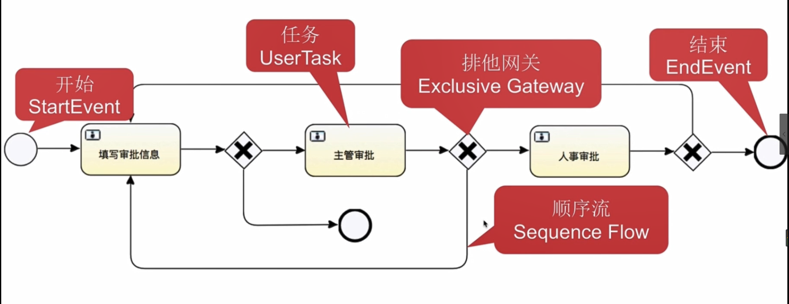
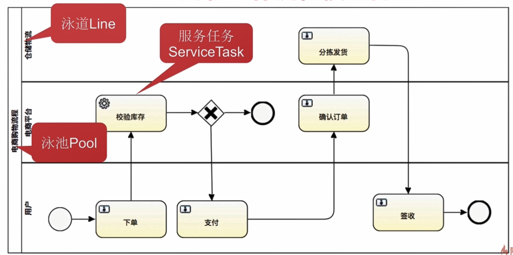
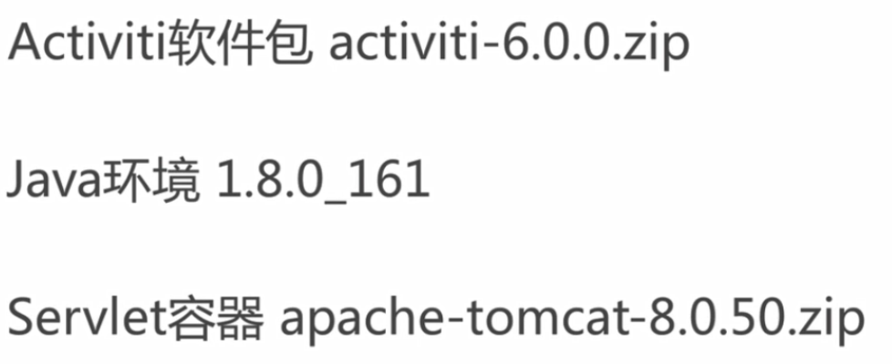
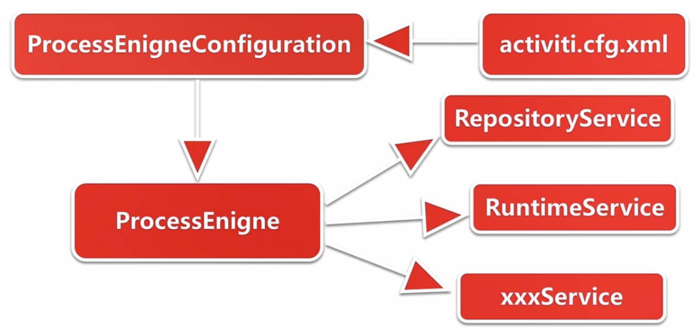

# 什么是工作流？

5W1H

workflow：多个参与者之间的任务协作

详细：

user task：具体用户组的待办任务

泳道

service task：调用接口，校验库存或者风控分析

官网直接部署

用户名和密码：admin/test

操作页面是APP工程，管理页面是ADMIN工程，是2个war包

创建demo

1. 部署activiti6.0
2. 打开APP页面登录
3. 创建用户
4. 创建流程

Assignment指定用户

创建APP

退出用户登录

使用dev用户登录并发起审批流程

可以添加comments备注

打开admin页面登录

登录admin页面可以看到历史流程

流程定义信息

# Activiti配置

流程引擎配置

入门

https://www.jianshu.com/p/701056e672a4

集成

https://blog.csdn.net/qq_21770005/article/details/78713912

封装

https://blog.csdn.net/sinosoft12345/article/details/81199907

封装实例：

https://blog.csdn.net/sinosoft12345/article/details/84745566