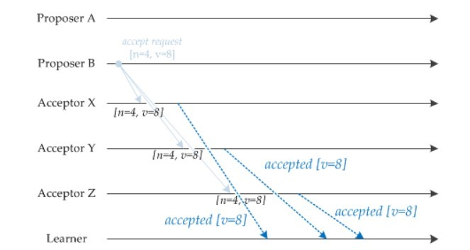
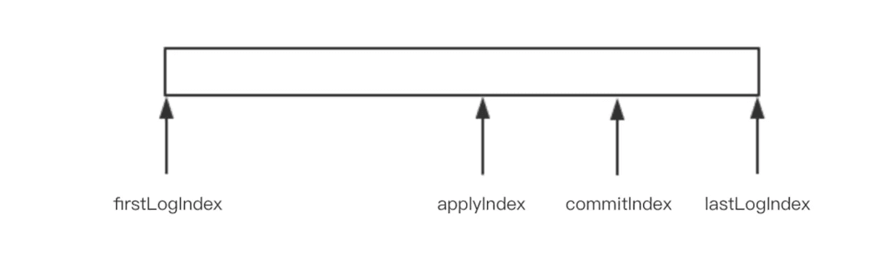

分布式系统不可能同时满足一致性（C：Consistency）、可用性（A：Availability）和分区容忍性（P：Partition Tolerance），最多只能同时满足其中两项 

多个数据副本保持数据一致

系统可用时间占所有时间的比重，4个9表示99.99%

区域划分，多个网络分区

P必须，因为网络不可靠

C和A做权衡

保持一致性，不能访问还没同步数据的节点，失去了部分可用性

保持可用性，数据不一致

一致性协议

### 2PC 两阶段提交

角色：

协调者

参与者

流程：can commit -> do commit

协调者 -> prepare消息 -> 参与者

参与者 -> ok or not -> 协调者

协调者收到都是ok，向参与者发出commit

如果有一个没有回复ok就等待，如果有一个回复not，就发出rollback给所有参与者

异常处理：

协调者备份多个

参与者故障，协调者会等待它重启

同时故障，问题， 1 2 3 4 5，4协调，1,2,3参与，5备用协调，4发给1和2，4故障，3故障，5接管协调，5等待3回复，3其实没有收到，就会一直等待。

问题：

同步阻塞，所以参与者在commit之前都是锁住表记录的

单点故障，协调者在发出commit之前故障，导致所有的参与者依然处于锁表状态

同时故障，一直等待，就是上面的问题

场景：

只考虑单机故障

### 3PC

流程优化：

can commit -> pre commit -> do commit

加入超时机制

流程：

1. can commit，协调者发从commit消息，此时参与者不锁定资源，不写redo、undo
2. pre commit，所有参与者返回ok，协调者发送prepare消息，有一个参与者没有返回或者返回not，协调者发送abort消息，这里加入了等待超时
3. do commit，如果所有的参与者都返回ok，协调者发送commit消息，参与者提交事务，否则回滚事务，如果协调者故障，这里引入了等待超时，就是参与者一段时间没有接收到commit消息，就本地提交

问题：

网络分区的情况下，数据不一致，因为有些参与者如果因为网络问题没有接收到回滚消息，超时引起提交，数据就不一致了

### Paxos协议

对多个节点产生的值，该算法能保证只选出唯一一个值 

三类节点：

- 提议者（Proposer）：提议一个值；
- 接受者（Acceptor）：对每个提议进行投票；
- 告知者（Learner）：被告知投票的结果，不参与投票过程。

 

一个提议包含两个字段：[n, v]，其中 n 为序号（具有唯一性），v 为提议值 

#### Prepare 阶段

 

 

当 Acceptor 接收到一个 Prepare 请求，包含的提议为 [n1, v1]，并且之前还未接收过 Prepare 请求，那么发送一个 Prepare 响应，设置当前接收到的提议为 [n1, v1]，并且保证以后不会再接受序号小于 n1 的提议。 

如果 Acceptor 接收到一个 Prepare 请求，包含的提议为 [n2, v2]，并且之前已经接收过提议 [n1, v1]。如果 n1 > n2，那么就丢弃该提议请求；否则，发送 Prepare 响应，该 Prepare 响应包含之前已经接收过的提议 [n1, v1]，设置当前接收到的提议为 [n2, v2]，并且保证以后不会再接受序号小于 n2 的提议。 

#### Accept 阶段 

当一个 Proposer 接收到超过一半 Acceptor 的 Prepare 响应时，就可以发送 Accept 请求。 

 

#### Learn 阶段

Acceptor 接收到 Accept 请求时，如果序号大于等于该 Acceptor 承诺的最小序号，那么就发送 Learn 提议给所有的 Learner。当 Learner 发现有大多数的 Acceptor 接收了某个提议，那么该提议的提议值就被 Paxos 选择出来。 

 

#### Raft协议

节点：

- Leader（主节点）：接受 client 更新请求，写入本地后，然后同步到其他副本中
- Follower（从节点）：从 Leader 中接受更新请求，然后写入本地日志文件。对客户端提供读请求
- Candidate（候选节点）：如果 follower 在一段时间内未收到 leader 心跳。则判断 leader 可能故障，发起选主提议。节点状态从 Follower 变为 Candidate 状态，直到选主结束

过程名词：

- termId：任期号，时间被划分成一个个任期，每次选举后都会产生一个新的 termId，一个任期内只有一个 leader。termId 相当于 paxos 的 proposalId。
- RequestVote：请求投票，candidate 在选举过程中发起，收到 quorum (多数派）响应后，成为 leader。
- AppendEntries：附加日志，leader 发送日志和心跳的机制
- election timeout：选举超时，如果 follower 在一段时间内没有收到任何消息(追加日志或者心跳)，就是选举超时。

竞选发生：

1. 在超时时间内没有收到 Leader 的心跳
2. 启动时

过程：

raft日志写入过程，主节点收到一个`x=1`的请求后，会写入本地日志，然后将`x=1`的日志广播出去，follower如果收到请求，会将日志写入本地 log ，然后返回成功。当 leader 收到半数以上的节点回应时，会将此日志的状态变为commit，然后广播消息让 follwer 提交日志。 

日志复制的本质是让 follwer 和 Leader 的已提交的日志顺序和内容都完全一样，用于保证一致性 

 

节点在 commit 日志后，会更新状态机中的 logindex 。 

firstLogIndex/lastLogIndex 为节点中开始和结束的索引位置（包含提交，未提交，写入状态机）commitIndex：已提交的索引。

applyIndex：已写入状态机中的索引 

原则1，两个日志在不同的 raft 节点中，如果有两个相同的 term 和 logIndex ，则保证两个日志的内容完全一样 。

- 在创建 logIndex 的时候使用新的 logIndex，保证 logIndex 的唯一性。而且创建之后不去更改。 

原则2，两段日志在不同的 raft 节点中，如果起始和终止的的 term，logIndex 都相同，那么两段日志中日志内容完全一样。 

- 在 Leader 复制给 Follower 时，要传递当前最新日志 currenTermId 和currentLogIndex，以及上一条日志 preCurrentTermId 和 preCurrentLogIndex 

#### Zookeeper 原理

ZAB协议 

只有一台机器能提议提案（Proposer），而这台机器的名称称之为 Leader 角色。其他参与者扮演 Acceptor 角色。为了保证 Leader 的健壮性，引入了 Leader 选举机制。 

1. 在半数以下节点宕机，依然能对外提供服务
2. 客户端所有的写请求，交由 Leader 来处理。写入成功后，需要同步给所有的 follower 和 observer
3. leader 宕机，或者集群重启。需要确保已经再 Leader 提交的事务最终都能被服务器提交，并且确保集群能快速回复到故障前的状态

https://tech.youzan.com/cap-coherence-protocol-and-application-analysis/

https://github.com/CyC2018/CS-Notes/blob/master/docs/notes/%E5%88%86%E5%B8%83%E5%BC%8F.md#%E4%B8%89cap

