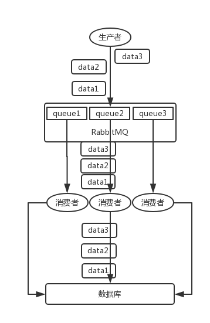

https://github.com/doocs/advanced-java

## 基础

核心应用场景：**解耦，异步，削峰**

解耦：A系统不需要考虑和其他系统的代码耦合，作为生产者，把数据直接扔到消息队列里面就可以，采用发布/订阅模式

异步：A系统需要和其他系统交互，并等待其他返回，可以直接扔到消息队列里面去，不需要等待其他系统返回，实现异步

削峰：业务高峰期的写或者查数据库请求，直接扔进MQ，A系统从MQ中按照一定频率读取请求，然后执行业务，不至于使数据库挂死

缺点：

1. 可用性降低，引入了中间件的结果，存在单点故障
2. 复杂度提高，重复消费消息，消息丢失，消息顺序性等
3. 一致性问题，多个订阅者，某个订阅者执行失败，导致与其他订阅者的数据存在不一致的问题

选型

ActiveMQ：不用

RabbitMQ：erlang，延迟微秒级，基本不丢失消失，主从架构，有活跃开源社区，首选

RocketMQ：阿里巴巴，活跃度不高

Kafka：大数据实时计算和日志采集唯一的选择

## RabbitMQ的高可用

主从架构

单机，普通集群，镜像集群

单机：生产不用

普通集群：提高吞吐量，所有的节点都可以提供某个queue的访问

每台机器上都存有queue的元数据，可以根据元数据找到对应queue所在的机器

1. queue在其他机器上，拉取到本机，然后提供给消费者---数据拉取开销
2. queue在本机，直接提供给消费者---单实例性能瓶颈

镜像集群：高可用

每个节点都有全部的queue，元数据，和消息

1. 开销太大，消息需要同步到所有节点上
2. 没有扩展性，某个queue负载很重，新增的机器也需要同步这个queue的所有数据，无法线性扩展

## Kafka的高可用

基本架构：多个broker，表示多个节点，一个topic有多个partition，分布于多个broker上

replica副本，partition的数据会有多个replica副本，replica有leader和follow两个角色，只能读写leader（不需要考虑数据一致性问题）

replica随机分布，不是所有机器上都有

broker宕机，重新选举leader即可

## 消息重复消费

基本问题，消息队列保证幂等性

一条数据重复出现两次，数据库里就只有一条数据，这就保证了系统的幂等性。 

由开发者保证，一般用数据库唯一键约束

## 消息丢失

RabbitMQ

 

1的解决：使用confirm机制，异步，发送完消息后，继续发送下一个，消息被MQ接收到了之后，会通知生产者（回调接口）

2的解决：持久化，持久化元数据和消息，持久化之后再回调1

3的解决：关闭MQ自动ack，消费者消费后调用MQ的API执行ACK

 

kafka同理，使用offset，配置方式不同

 

## 消息顺序性

**RabbitMQ**：一个 queue，多个 consumer。 

**Kafka**： 消费者里可能会有**多个线程来并发处理消息** 

RabbitMQ，拆分多个queue

 

kafka

写 N 个内存 queue，具有相同 key 的数据都到同一个内存 queue；然后对于 N 个线程，每个线程分别消费一个内存 queue 即可，这样就能保证顺序性

感觉像是线程本地存储

 

## 消息队列延时和过期失效

消息积压

- 先修复 consumer 的问题，确保其恢复消费速度，然后将现有 consumer 都停掉。
- 新建一个 topic，partition 是原来的 10 倍，临时建立好原先 10 倍的 queue 数量。
- 然后写一个临时的分发数据的 consumer 程序，这个程序部署上去消费积压的数据，**消费之后不做耗时的处理**，直接均匀轮询写入临时建立好的 10 倍数量的 queue。
- 接着临时征用 10 倍的机器来部署 consumer，每一批 consumer 消费一个临时 queue 的数据。这种做法相当于是临时将 queue 资源和 consumer 资源扩大 10 倍，以正常的 10 倍速度来消费数据。
- 等快速消费完积压数据之后，**得恢复原先部署的架构**，**重新**用原先的 consumer 机器来消费消息。

消息过期

写程序，补消息

