# 并发基础

## 并发优缺点

多核CPU

- 充分利用多核心处理能力
- 拆分业务，提升应用性能

问题和解决

1. 频繁的上下文切换
   - 无锁并发编程，concurrenthashmap，不同线程处理不同段数据
   - cas算法，乐观锁
   - 尽量少的线程
   - 协程，单线程里面实现多任务调度
2. 线程安全-死锁
   - 一个线程一个锁
   - 一个线程不要在锁内部占用多个资源
   - 锁加入超时机制
   - 数据库的锁，保持加锁和解锁在同一个连接

概念

- 同步，异步
- 并发，并行
- 阻塞，非阻塞
- 临界区

## 基本操作

新建线程

```java
java程序天生就是一个多线程程序
（1）分发处理发送给给JVM信号的线程；
（2）调用对象的finalize方法的线程；
（3）清除Reference的线程；
（4）main线程，用户程序的入口。
```

```java
新建线程的方法
通过继承Thread类，重写run方法；

通过实现runable接口；

通过实现callable接口;有返回值

```

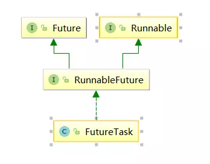 

- 单继承多实现，继承整个类开销太大，使用实现接口的方式

线程状态

 

- 当线程进入到synchronized方法或者synchronized代码块时，线程切换到的是BLOCKED状态，而使用java.util.concurrent.locks下lock进行加锁的时候线程切换的是WAITING或者TIMED_WAITING状态，因为lock会调用LockSupport的方法。

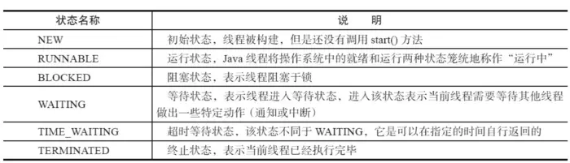 

线程间通信方式

中断interrupted

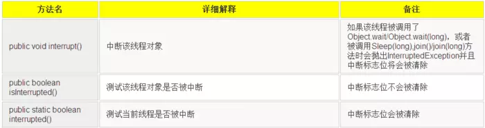 


join

如果一个线程实例A执行了threadB.join(),其含义是：当前线程A会等待threadB线程终止后threadA才会继续执行 

当前等待对象threadA会一直阻塞，直到被等待对象threadB结束后即isAlive()返回false的时候才会结束while循环，当threadB退出时会调用notifyAll()方法通知所有的等待线程 


sleep

```java
Thread
public static native void sleep(long millis)
```

休眠时间的精度取决于处理器的计时器和调度器 

```java
sleep()方法是Thread的静态方法，而wait是Object实例方法

wait()方法必须要在同步方法或者同步块中调用，也就是必须已经获得对象锁。而sleep()方法没有这个限制可以在任何地方使用。另外，wait()方法会释放占有的对象锁，使得该线程进入等待池中，等待下一次获取资源。而sleep()方法只是会让出CPU并不会释放掉对象锁；

sleep()方法在休眠时间达到后如果再次获得CPU时间片就会继续执行，而wait()方法必须等待Object.notift/Object.notifyAll通知后，才会离开等待池，并且再次获得CPU时间片才会继续执行。
```


yield

```java
Thread
public static native void yield();
```

yield()方法只允许与当前线程具有相同优先级的线程能够获得释放出来的CPU时间片 

优先级的范围从1~10.在构建线程的时候可以通过**setPriority(int)**方法进行设置，默认优先级为5，优先级高的线程相较于优先级低的线程优先获得处理器时间片。需要注意的是在不同JVM以及操作系统上，线程规划存在差异，有些操作系统甚至会忽略线程优先级的设定。

 

 Daemon

守护线程

垃圾回收线程，JIT线程 

```java
daemonThread.setDaemon(true);
daemonThread.start();
```


**守护线程在退出的时候并不会执行finnaly块中的代码，所以将释放资源等操作不要放在finnaly块中执行，这种操作是不安全的** 


#  JMM

出现线程安全的问题一般是因为**主内存和工作内存数据不一致性**和**重排序**导致的 

线程间协作通信 

- 共享变量
- 通知机制


共享变量

所有**实例域，静态域和数组元素**都是放在堆内存中（所有线程均可访问到，是可以共享的），而局部变量，方法定义参数和异常处理器参数不会在线程间共享。共享数据会出现线程安全的问题，而非共享数据不会出现线程安全的问题 


JMM抽象

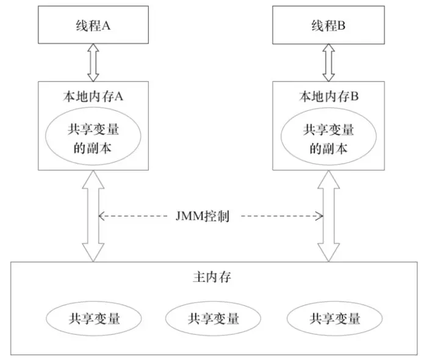 

通过同步机制（控制不同线程间操作发生的相对顺序）来解决或者通过volatile关键字使得每次volatile变量都能够强制刷新到主存，从而对每个线程都是可见的 


重排序

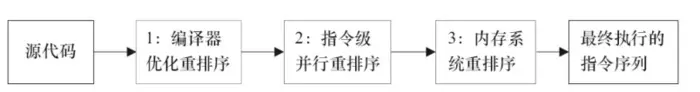 

**编译器重排序** 

编译器优化的重排序。编译器在不改变单线程程序语义的前提下，可以重新安排语句的执行顺序；

解决：禁止一些**特定类型的编译器重排序** 

**处理器重排序** 

指令级并行的重排序。现代处理器采用了指令级并行技术来将多条指令重叠执行。如果**不存在数据依赖性**，处理器可以改变语句对应机器指令的执行顺序；

内存系统的重排序。由于处理器使用缓存和读/写缓冲区，这使得加载和存储操作看上去可能是在乱序执行的。

解决：

编译器生成指令序列的时候会通过插入内存屏障指令来禁止某些特殊的处理器重排序 


**如果两个操作访问同一个变量，且这两个操作有一个为写操作，此时这两个操作就存在数据依赖性** 


**happens-before** 

两个操作之间的执行顺序 

两个操作可以在一个线程之内，也可以是在不同线程之间 

Java内存模型将向程序员保证——A操作的结果将对B可见，且A的执行顺序排在B之前 

只要不改变程序的执行结果（指的是单线程程序和正确同步的多线程程序），编译器和处理器怎么优化都行 


8个规则

程序顺序规则：一个线程中的每个操作，happens-before于该线程中的任意后续操作。

监视器锁规则：对一个锁的解锁，happens-before于随后对这个锁的加锁。

volatile变量规则：对一个volatile域的写，happens-before于任意后续对这个volatile域的读。

传递性：如果A happens-before B，且B happens-before C，那么A happens-before C。

start()规则：如果线程A执行操作ThreadB.start()（启动线程B），那么A线程的ThreadB.start()操作happens-before于线程B中的任意操作。

join()规则：如果线程A执行操作ThreadB.join()并成功返回，那么线程B中的任意操作happens-before于线程A从ThreadB.join()操作成功返回。

程序中断规则：对线程interrupted()方法的调用先行于被中断线程的代码检测到中断时间的发生。

对象finalize规则：一个对象的初始化完成（构造函数执行结束）先行于发生它的finalize()方法的开始。

 

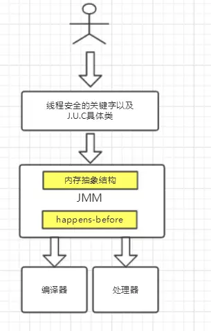 


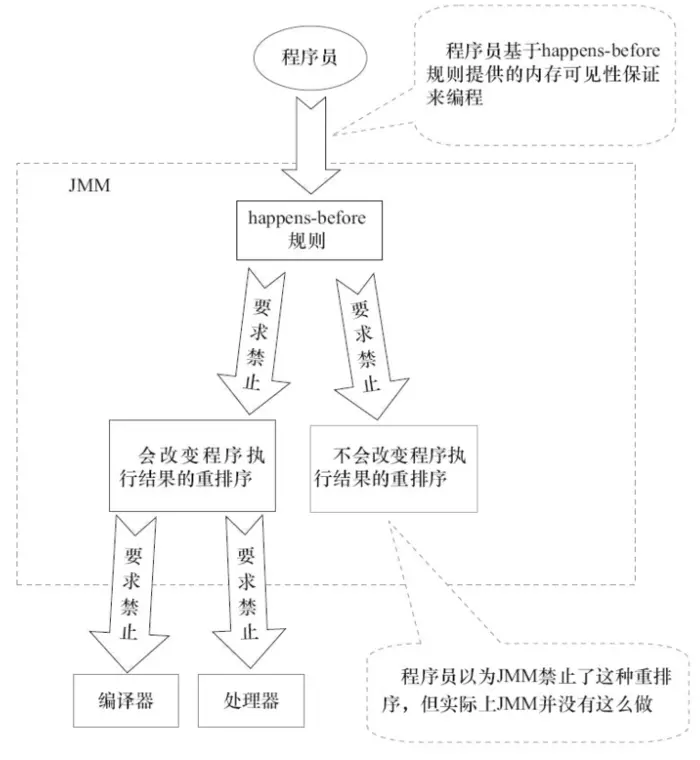 


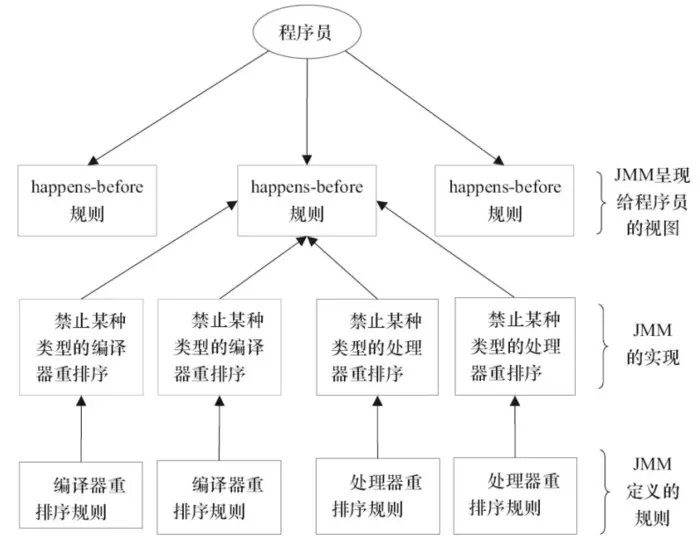 


# 并发关键字

## synchronized

使用场景

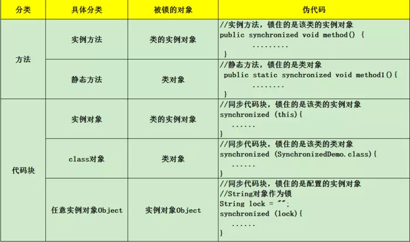 


原理：

```java
package Synchronized;

public class SynchronizedDemo {
  public static void main(String[] args) {
    synchronized (SynchronizedDemo.class) {
    }
    method();
  }

  private static void method() {
  }
}
```


```shell
javap -v SynchronizedDemo
警告: 二进制文件SynchronizedDemo包含Synchronized.SynchronizedDemo
Classfile /src/main/java/Synchronized/SynchronizedDemo.class
  Last modified 2019-3-29; size 490 bytes
  MD5 checksum e51ecc4063b4b32c1aa9e615740f1f39
  Compiled from "SynchronizedDemo.java"
public class Synchronized.SynchronizedDemo
  minor version: 0
  major version: 52
  flags: ACC_PUBLIC, ACC_SUPER
Constant pool:
   #1 = Methodref          #4.#18         // java/lang/Object."<init>":()V
   #2 = Class              #19            // Synchronized/SynchronizedDemo
   #3 = Methodref          #2.#20         // Synchronized/SynchronizedDemo.method:()V
   #4 = Class              #21            // java/lang/Object
   #5 = Utf8               <init>
   #6 = Utf8               ()V
   #7 = Utf8               Code
   #8 = Utf8               LineNumberTable
   #9 = Utf8               main
  #10 = Utf8               ([Ljava/lang/String;)V
  #11 = Utf8               StackMapTable
  #12 = Class              #22            // "[Ljava/lang/String;"
  #13 = Class              #21            // java/lang/Object
  #14 = Class              #23            // java/lang/Throwable
  #15 = Utf8               method
  #16 = Utf8               SourceFile
  #17 = Utf8               SynchronizedDemo.java
  #18 = NameAndType        #5:#6          // "<init>":()V
  #19 = Utf8               Synchronized/SynchronizedDemo
  #20 = NameAndType        #15:#6         // method:()V
  #21 = Utf8               java/lang/Object
  #22 = Utf8               [Ljava/lang/String;
  #23 = Utf8               java/lang/Throwable
{
  public Synchronized.SynchronizedDemo();
    descriptor: ()V
    flags: ACC_PUBLIC
    Code:
      stack=1, locals=1, args_size=1
         0: aload_0
         1: invokespecial #1                  // Method java/lang/Object."<init>":()V
         4: return
      LineNumberTable:
        line 3: 0

  public static void main(java.lang.String[]);
    descriptor: ([Ljava/lang/String;)V
    flags: ACC_PUBLIC, ACC_STATIC
    Code:
      stack=2, locals=3, args_size=1
         0: ldc           #2                  // class Synchronized/SynchronizedDemo
         2: dup
         3: astore_1
         4: monitorenter // 进入同步代码块
         5: aload_1
         6: monitorexit // 退出同步代码块
         7: goto          15
        10: astore_2
        11: aload_1
        12: monitorexit
        13: aload_2
        14: athrow
        15: invokestatic  #3                  // Method method:()V
        18: return
      Exception table:
         from    to  target type
             5     7    10   any
            10    13    10   any
      LineNumberTable:
        line 5: 0
        line 6: 5
        line 7: 15
        line 8: 18
      StackMapTable: number_of_entries = 2
        frame_type = 255 /* full_frame */
          offset_delta = 10
          locals = [ class "[Ljava/lang/String;", class java/lang/Object ]
          stack = [ class java/lang/Throwable ]
        frame_type = 250 /* chop */
          offset_delta = 4
}
SourceFile: "SynchronizedDemo.java"
```

使用Synchronized进行同步，其关键就是必须要对对象的监视器monitor进行获取 

当线程获取monitor后才能继续往下执行，否则就只能等待 

**锁的重入性** 执行静态同步方法的时候就只有一条monitorexit指令，并没有monitorenter获取锁的指令 

同一锁程中，线程不需要再次获取同一把锁 

**每个对象拥有一个计数器，当线程获取该对象锁后，计数器就会加一，释放锁后就会将计数器减一** 


  


```java
public class MonitorDemo {
  private int a = 0;

  public synchronized void writer() {     // 1
    a++;                                // 2
  }                                       // 3

  public synchronized void reader() {    // 4
    int i = a;                         // 5
  }                                      // 6
}
```


 


synchronized优化

**CAS(compare and swap)** ，无锁操作，需要硬件指令集的支撑 

**V 内存地址存放的实际值；O 预期的值（旧值）；N 更新的新值** 

问题：

- ABA问题，解决：加版本号`AtomicStampedReference`
- 自旋时间过长
- **只能保证一个共享变量的原子操作**，利用对象整合多个共享变量，即一个类中的成员变量就是这几个共享变量。然后将这个对象做CAS操作就可以保证其原子性 `AtomicReference `


**Java对象头**

Java对象头里的Mark Word里默认的存放的对象的Hashcode,分代年龄和锁标记位 

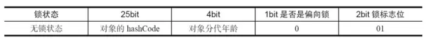 

**无锁状态、偏向锁状态、轻量级锁状态和重量级锁状态** 

**锁可以升级但不能降级** 

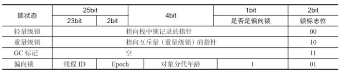 


**偏向锁**

获取

当一个线程访问同步块并获取锁时，会在**对象头**和**栈帧中的锁记录**里存储锁偏向的线程ID，以后该线程在进入和退出同步块时不需要进行CAS操作来加锁和解锁，只需简单地测试一下对象头的Mark Word里是否存储着指向当前线程的偏向锁。如果测试成功，表示线程已经获得了锁。如果测试失败，则需要再测试一下Mark Word中偏向锁的标识是否设置成1（表示当前是偏向锁）：如果没有设置，则使用CAS竞争锁；如果设置了，则尝试使用CAS将对象头的偏向锁指向当前线程

 撤销

偏向锁使用了一种**等到竞争出现才释放锁**的机制，所以当其他线程尝试竞争偏向锁时，持有偏向锁的线程才会释放锁。 

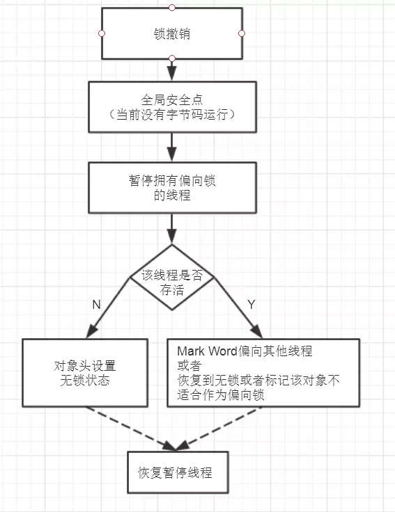 


偏向锁的撤销，需要等待**全局安全点**（在这个时间点上没有正在执行的字节码）。它会首先暂停拥有偏向锁的线程，然后检查持有偏向锁的线程是否活着，如果线程不处于活动状态，则将对象头设置成无锁状态；如果线程仍然活着，拥有偏向锁的栈会被执行，遍历偏向对象的锁记录，栈中的锁记录和对象头的Mark Word**要么**重新偏向于其他线程，**要么**恢复到无锁或者标记对象不适合作为偏向锁，最后唤醒暂停的线程

 

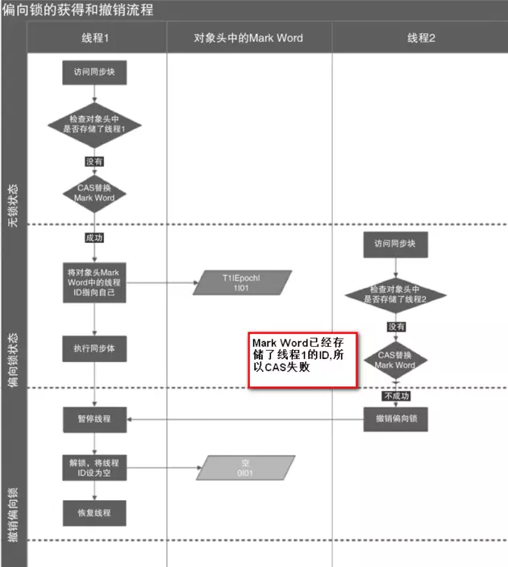 


**轻量级锁**

加锁

线程在执行同步块之前，JVM会先在当前线程的栈桢中**创建用于存储锁记录的空间**，并将对象头中的Mark Word复制到锁记录中，官方称为**Displaced Mark Word**。然后线程尝试使用CAS**将对象头中的Mark Word替换为指向锁记录的指针**。如果成功，当前线程获得锁，如果失败，表示其他线程竞争锁，当前线程便尝试使用自旋来获取锁。


解锁

轻量级解锁时，会使用原子的CAS操作将Displaced Mark Word替换回到对象头，如果成功，则表示没有竞争发生。如果失败，表示当前锁存在竞争，锁就会膨胀成重量级锁。 

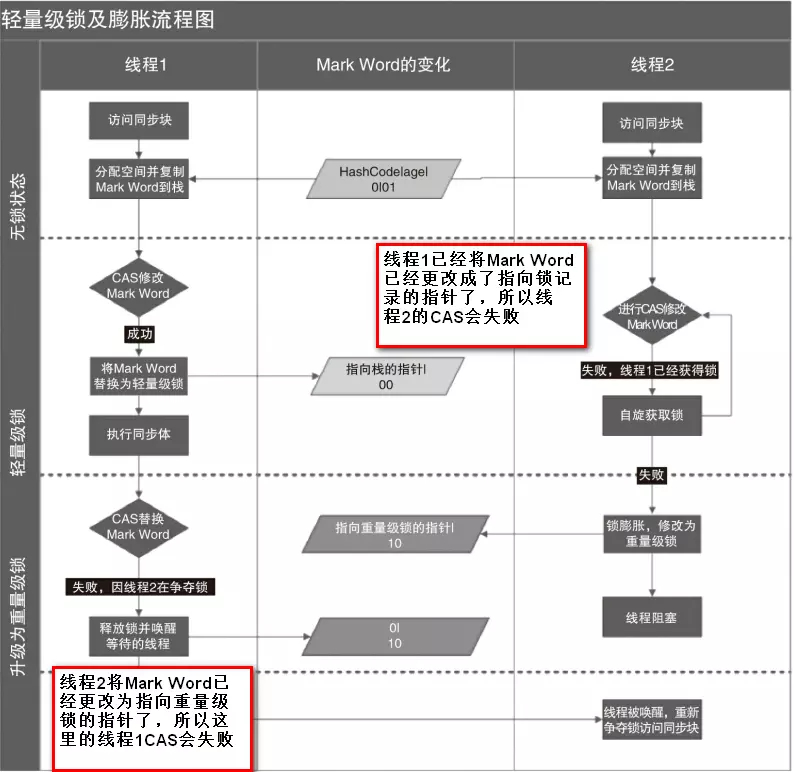 


比较

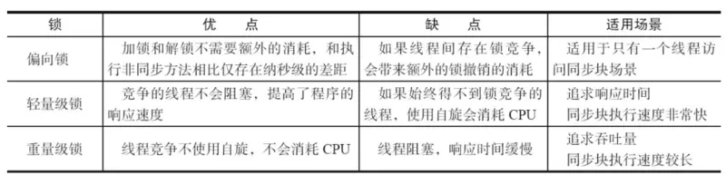 


## volatile

java虚拟机提供的最轻量级的同步机制 

**被volatile修饰的变量能够保证每个线程能够获取该变量的最新值，从而避免出现数据脏读的现象** 

汇编代码 多出**Lock前缀的指令** 

1. 将当前处理器缓存行的数据写回系统内存；
2. 这个写回内存的操作会使得其他CPU里缓存了该内存地址的数据无效

**缓存一致性**协议 

**每个处理器通过嗅探在总线上传播的数据来检查自己缓存的值是不是过期**了 


```java
public class VolatileExample {
    private int a = 0;
    private volatile boolean flag = false;
    public void writer(){
        a = 1;          //1
        flag = true;   //2
    }
    public void reader(){
        if(flag){      //3
            int i = a; //4
        }
    }
}
```


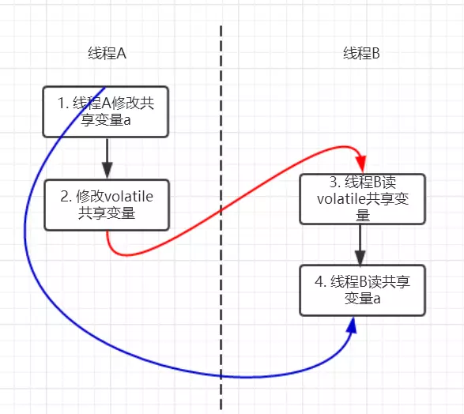 

**volatile变量的写happens-before 于任意后续对volatile变量的读** 


JMM内存屏障

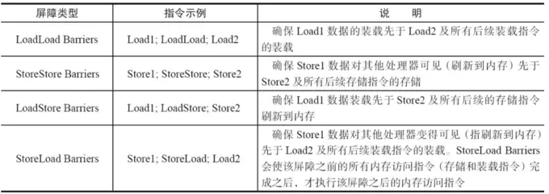 

编译器会在生成指令系列时在适当的位置会插入内存屏障指令来禁止特定类型的处理器重排序 

"NO"表示禁止重排序 

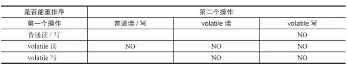 


在每个volatile写操作的**前面**插入一个StoreStore屏障；

在每个volatile写操作的**后面**插入一个StoreLoad屏障；

在每个volatile读操作的**后面**插入一个LoadLoad屏障；

在每个volatile读操作的**后面**插入一个LoadStore屏障。

 

 **StoreStore屏障**：禁止上面的普通写和下面的volatile写重排序；

**StoreLoad屏障**：防止上面的volatile写与下面可能有的volatile读/写重排序

**LoadLoad屏障**：禁止下面所有的普通读操作和上面的volatile读重排序

**LoadStore屏障**：禁止下面所有的普通写操作和上面的volatile读重排序

 

 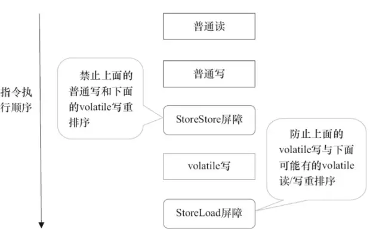 


## final

修饰**变量，方法和类**，用于表示所修饰的内容一旦赋值之后就不会再被改变 


### 变量

- **成员变量** 
- **方法局部变量**


**类变量（static修饰的变量）以及实例变量** 

类变量可以在声明变量的时候直接赋初值或者在静态代码块中给类变量赋初值 

实例变量可以在声明变量的时候给实例变量赋初值，在非静态初始化块中以及构造器中赋初值 

```java
public class FinalExample {
  //类变量（static修饰的变量） - 1
  //实例变量 - 2

  private final int a = 1;//2.1 声明变量的时候给实例变量赋初值
  private final String str;
  private final static boolean b;
  private final static int d = 1;//1.1 声明变量的时候给类变量赋初值
  private final double c;

//  private final char ch; // 没有在2.1 2.2 2.3位置赋值，报错

  {
    str = "非静态初始化代码块赋值";//2.2 非静态初始化代码块赋值
  }

  static {
    b = true;//1.2 静态代码块中给类变量赋初值
//    str = "非静态变量不能再静态初始块中赋值";
  }

  public FinalExample() {
    c = 1.0;//2.3 构造器中赋初值
//    a = 10;//已经赋值了不能再更改
  }

  public void a() {
//    ch = 'a';//实例方法不能给final实例变量赋值
  }
}
```


方法局部变量

```java
  public void test(final int a) {
    final int b;
    b = 1;
//    b = 2;//上面已经赋值，不能重复赋值
//    a = 3;//入参已经赋值，不能重复赋值
  }
```


final基本类型和引用类型

**final只保证这个引用类型变量所引用的地址不会发生改变，即一直引用这个对象，但这个对象属性是可以改变的** 


宏变量

1. 使用final修饰符修饰；
2. 在定义该final变量时就指定了初始值；
3. 该初始值在编译时就能够唯一指定。

当程序中其他地方使用该宏变量的地方，编译器会直接替换成该变量的值 


### 方法

**1. 父类的final方法是不能够被子类重写的**

**2. final方法是可以被重载的**


### 类

**类被final修饰时，表名该类是不能被子类继承的** 

创建该类的实例后，该实例的实例变量是不可改变的 

使用private和final修饰符来修饰该类的成员变量

提供带参的构造器用于初始化类的成员变量；

仅为该类的成员变量提供getter方法，不提供setter方法，因为普通方法无法修改fina修饰的成员变量；

如果有必要就重写Object类 的hashCode()和equals()方法，应该保证用equals()判断相同的两个对象其Hashcode值也是相等的。


###  final域重排

基本类型

```java
public class FinalDemo {
    private int a;  //普通域
    private final int b; //final域
    private static FinalDemo finalDemo;

    public FinalDemo() {
        a = 1; // 1. 写普通域
        b = 2; // 2. 写final域
    }

    public static void writer() {
        finalDemo = new FinalDemo();
    }

    public static void reader() {
        FinalDemo demo = finalDemo; // 3.读对象引用
        int a = demo.a;    //4.读普通域
        int b = demo.b;    //5.读final域
    }
}

```

假设线程A在执行writer()方法，线程B执行reader()方法 


写：**禁止对final域的写重排序到构造函数之外** 

普通域（普通变量）a可能会被重排序到构造函数之外，线程B就有可能读到的是普通变量a初始化之前的值（零值） 

**在对象引用为任意线程可见之前，对象的final域已经被正确初始化过了，而普通域就不具有这个保障** 

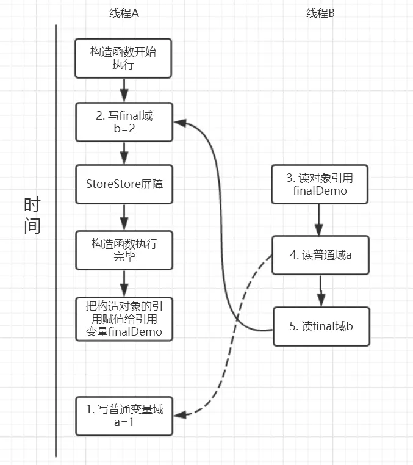 


读：**在一个线程中，初次读对象引用和初次读该对象包含的final域，JMM会禁止这两个操作的重排序** 

**在读一个对象的final域之前，一定会先读这个包含这个final域的对象的引用** 

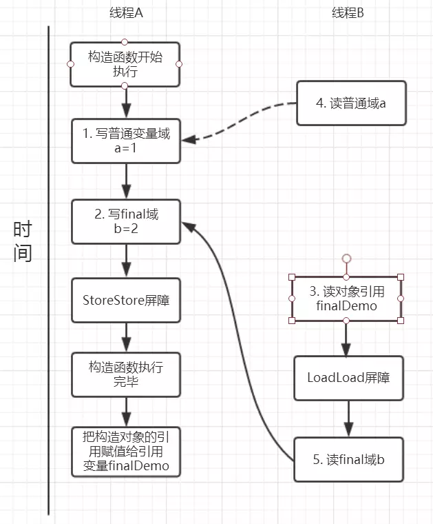 


引用类型

```java
public class FinalReferenceDemo {
    final int[] arrays;
    private FinalReferenceDemo finalReferenceDemo;

    public FinalReferenceDemo() {
        arrays = new int[1];  //1
        arrays[0] = 1;        //2
    }

    public void writerOne() {
        finalReferenceDemo = new FinalReferenceDemo(); //3
    }

    public void writerTwo() {
        arrays[0] = 2;  //4
    }

    public void reader() {
        if (finalReferenceDemo != null) {  //5
            int temp = finalReferenceDemo.arrays[0];  //6
        }
    }
}

```

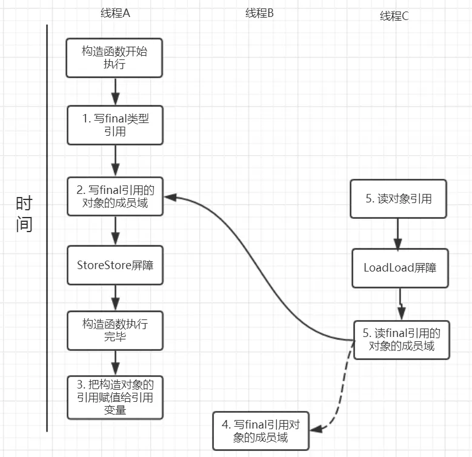 

写线程B对数组元素的写入可能看到可能看不到。JMM不保证线程B的写入对线程C可见，线程B和线程C之间存在数据竞争，此时的结果是不可预知的。如果可见的，可使用锁或者volatile 


### 实现原理

处理器


**在构造函数，不能让这个被构造的对象被其他线程可见，也就是说该对象引用不能在构造函数中“逸出”** 

```java
public class FinalReferenceEscapeDemo {
  private final int a;
  private FinalReferenceEscapeDemo referenceDemo;

  public FinalReferenceEscapeDemo() {
    a = 1;  //1
    referenceDemo = this; //2 引用对象“this”逸出，该代码依然存在线程安全的问题
  }

  public void writer() {
    new FinalReferenceEscapeDemo();
  }

  public void reader() {
    if (referenceDemo != null) {  //3
      int temp = referenceDemo.a; //4
    }
  }
}
```


## 3大性质

### 原子

JMM

lock(锁定)：作用于主内存中的变量，它把一个变量标识为一个线程独占的状态；

unlock(解锁):作用于主内存中的变量，它把一个处于锁定状态的变量释放出来，释放后的变量才可以被其他线程锁定

read（读取）：作用于主内存的变量，它把一个变量的值从主内存传输到线程的工作内存中，以便后面的load动作使用；

load（载入）：作用于工作内存中的变量，它把read操作从主内存中得到的变量值放入工作内存中的变量副本

use（使用）：作用于工作内存中的变量，它把工作内存中一个变量的值传递给执行引擎，每当虚拟机遇到一个需要使用到变量的值的字节码指令时将会执行这个操作；

assign（赋值）：作用于工作内存中的变量，它把一个从执行引擎接收到的值赋给工作内存的变量，每当虚拟机遇到一个给变量赋值的字节码指令时执行这个操作；

store（存储）：作用于工作内存的变量，它把工作内存中一个变量的值传送给主内存中以便随后的write操作使用；

write（操作）：作用于主内存的变量，它把store操作从工作内存中得到的变量的值放入主内存的变量中。

 

 Java 内存模型允许虚拟机将没有被 volatile 修饰的 64 位数据（long，double）的读写操作划分为两次 32 位的操作来进行，即 load、store、read 和 write 操作可以不具备原子性 


### 有序性

在本线程内观察，所有操作都是有序的。在一个线程观察另一个线程，所有操作都是无序的，无序是因为发生了指令重排序 

**volatile包含禁止指令重排序的语义，其具有有序性** 

```java
public class Singleton {
    private Singleton() { }
    private volatile static Singleton instance;
    public Singleton getInstance(){
        if(instance==null){
            synchronized (Singleton.class){
                if(instance==null){
                    instance = new Singleton();
                }
            }
        }
        return instance;
    }
}

```

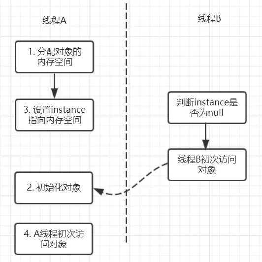 


### 可见性

当线程获取锁时会从主内存中获取共享变量的最新值，释放锁的时候会将共享变量同步到主内存中 **synchronized具有可见性** 


**volatile具有可见性** 


## Lock体系

concurrent包 

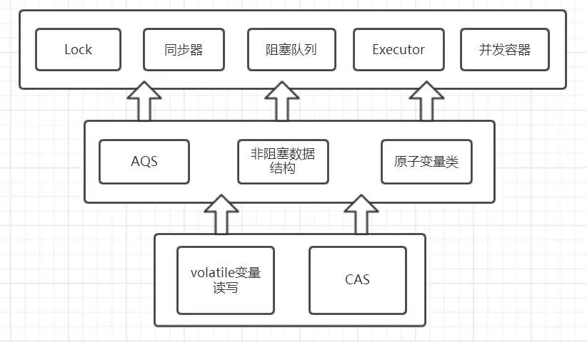 

### Lock

**虽然它失去了像synchronize关键字隐式加锁解锁的便捷性，但是却拥有了锁获取和释放的可操作性，可中断的获取锁以及超时获取锁等多种synchronized关键字所不具备的同步特性。** 

**synchronized同步块执行完成或者遇到异常是锁会自动释放，而lock必须调用unlock()方法释放锁，因此在finally块中释放锁** 

```java
Lock lock = new ReentrantLock();
lock.lock();
try{
	.......
}finally{
	lock.unlock();
}

```

API

```java
void lock(); //获取锁
void lockInterruptibly() throws InterruptedException；//获取锁的过程能够响应中断
boolean tryLock();//非阻塞式响应中断能立即返回，获取锁返回true反之返回fasle
boolean tryLock(long time, TimeUnit unit) throws InterruptedException;//超时获取锁，在超时内或者未中断的情况下能够获取锁
Condition newCondition();//获取与lock绑定的等待通知组件，当前线程必须获得了锁才能进行等待，进行等待时会先释放锁，当再次获取锁时才能从等待中返回
```

基于AbstractQueuedSynchronizer 实现


### AbstractQueuedSynchronizer 

AQS

同步器

实现主要依赖一个int成员变量来表示同步状态以及通过一个FIFO队列构成等待队列 


**子类必须重写AQS的几个protected修饰的用来改变同步状态的方法**，其他方法主要是实现了排队和阻塞机制。**状态的更新使用getState,setState以及compareAndSetState这三个方法** 


模板方法设计模式

将**一些方法开放给子类进行重写，而同步器给同步组件所提供模板方法又会重新调用被子类所重写的方法** 


Lock的实现：

同步组件（这里不仅仅值锁，还包括CountDownLatch等）的实现依赖于同步器AQS，在同步组件实现中，使用AQS的方式被推荐定义继承AQS的静态内存类；

AQS采用模板方法进行设计，AQS的protected修饰的方法需要由继承AQS的子类进行重写实现，当调用AQS的子类的方法时就会调用被重写的方法；

AQS负责同步状态的管理，线程的排队，等待和唤醒这些底层操作，而Lock等同步组件主要专注于实现同步语义；

在重写AQS的方式时，使用AQS提供的`getState(),setState(),compareAndSetState()`方法进行修改同步状态

 

 AQS提供的模板方法可以分为3类：

1. 独占式获取与释放同步状态；
2. 共享式获取与释放同步状态；
3. 查询同步队列中等待线程情况；


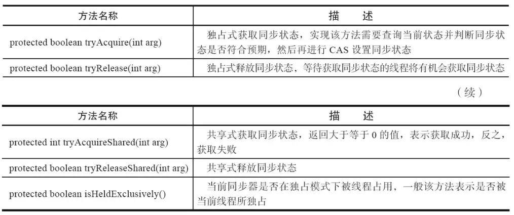 


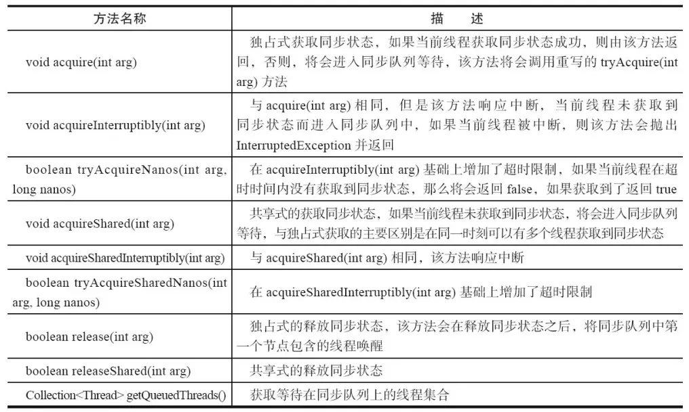 


 


 

 


 


 

 

 

 


 

 

 

 

 

 


 

 


 

 

 


 


参考资料

https://github.com/CL0610/Java-concurrency

