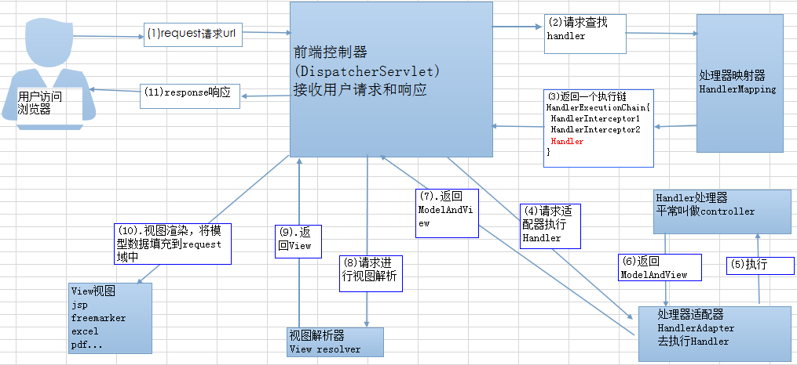

https://github.com/Snailclimb/JavaGuide/blob/master/docs/system-design/framework/SpringMVC%20%E5%B7%A5%E4%BD%9C%E5%8E%9F%E7%90%86%E8%AF%A6%E8%A7%A3.md

核心类是 DispatcherServlet 

 

（1）客户端（浏览器）发送请求，直接请求到 DispatcherServlet。

（2）DispatcherServlet 根据请求信息调用 HandlerMapping，解析请求对应的 Handler。

（3）解析到对应的 Handler（也就是我们平常说的 Controller 控制器）后，开始由 HandlerAdapter 适配器处理。

（4）HandlerAdapter 会根据 Handler 来调用真正的处理器开处理请求，并处理相应的业务逻辑。

（5）处理器处理完业务后，会返回一个 ModelAndView 对象，Model 是返回的数据对象，View 是个逻辑上的 View。

（6）ViewResolver 会根据逻辑 View 查找实际的 View。

（7）DispaterServlet 把返回的 Model 传给 View（视图渲染）。

（8）把 View 返回给请求者（浏览器）

