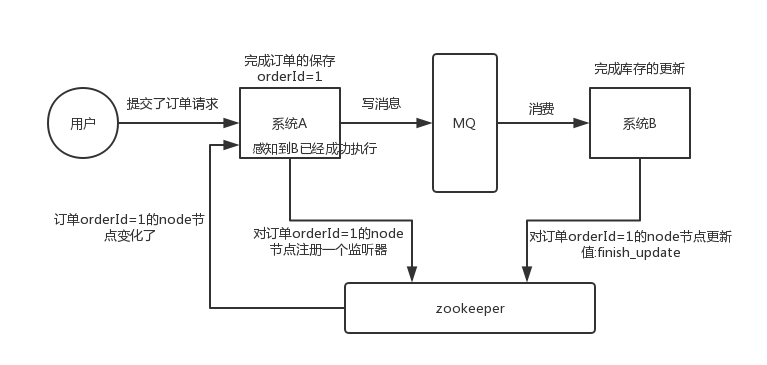
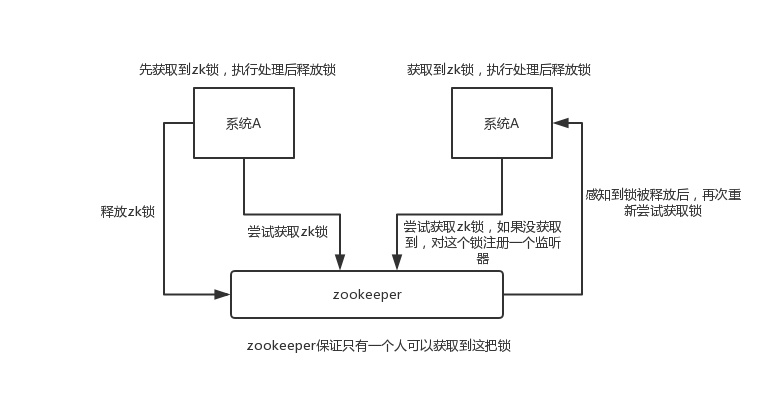
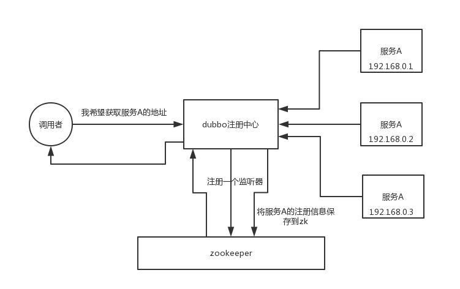
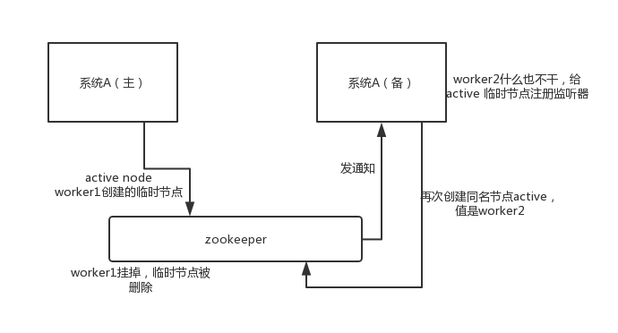

https://github.com/doocs/advanced-java/blob/master/docs/distributed-system/zookeeper-application-scenarios.md

- 分布式协调
- 分布式锁
- 元数据/配置信息管理
- HA高可用性

A 系统发送请求之后可以在 zookeeper 上**对某个节点的值注册个监听器**，一旦 B 系统处理完了就修改 zookeeper 那个节点的值，A 系统立马就可以收到通知 

 

分布式锁

一个机器接收到了请求之后先获取 zookeeper 上的一把分布式锁，就是可以去创建一个 znode，接着执行操作；然后另外一个机器也**尝试去创建**那个 znode，结果发现自己创建不了，因为被别人创建了，那只能等着，等第一个机器执行完了自己再执行 

 

配置信息管理

 

高可用

 

