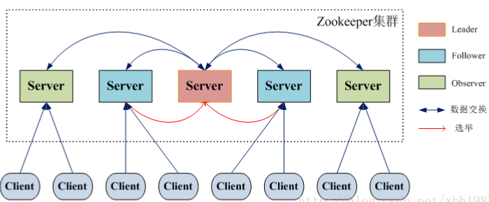

https://github.com/Snailclimb/JavaGuide/blob/master/docs/system-design/framework/ZooKeeper.md

**ZooKeeper 是一个典型的分布式数据一致性解决方案，分布式应用程序可以基于 ZooKeeper 实现诸如数据发布/订阅、负载均衡、命名服务、分布式协调/通知、集群管理、Master 选举、分布式锁和分布式队列等功能。** 

**最好使用奇数台服务器构成 ZooKeeper 集群？** 

zookeeper容错是指，当宕掉几个zookeeper服务器之后，剩下的个数必须大于宕掉的个数的话整个zookeeper才依然可用 

**在 ZooKeeper 中，一个客户端连接是指客户端和服务器之间的一个 TCP 长连接**。 

**通过这个连接，客户端能够通过心跳检测与服务器保持有效的会话，也能够向Zookeeper服务器发送请求并接受响应，同时还能够通过该连接接收来自服务器的Watch事件通知。**  

**在Zookeeper中，“节点"分为两类，第一类同样是指构成集群的机器，我们称之为机器节点；第二类则是指数据模型中的数据单元，我们称之为数据节点一一ZNode。** 

 

ZAB协议

