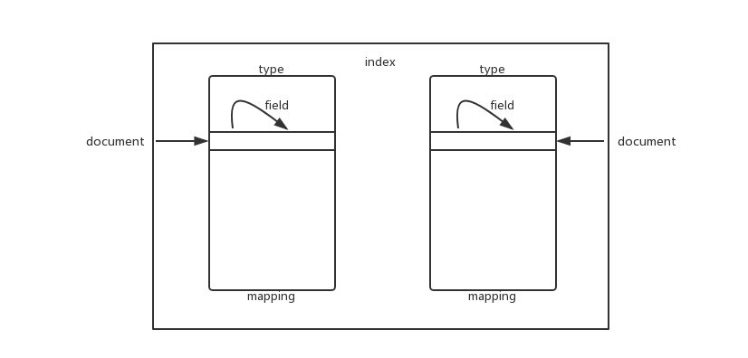

https://github.com/doocs/advanced-java/blob/master/docs/high-concurrency/es-architecture.md

## elasticsearch

分布式搜索引擎，底层lucene

多台机器上启动多个es进程实例，形成一个es集群

es的master节点：维护索引元数据，负责切换primary和replica shard

组成

index

type

mapping

document

field

订单index，一个index多个type

实物type订单

虚拟商品type订单

一个type一个mapping，相当于表结构定义

一个document就是一个记录，field就是字段值

 

索引有多个shard，分别存储部分数据，支持横向扩展

shard有primary shard（主，写入，同步给副本）和replica shard（副本）

 

## 写数据

 

1. 选择一个node发送写请求，这个node是coordinating node 协调节点
2. 协调节点路由document，转发到对应的node（primary shard）
3. 实际的node的primary shard处理请求，数据同步到replica node
4. 协调节点在primary node 和 replica node都完成写入后，响应结果给客户端

## 读数据

doc id -> hash -> shard

1. 发送请求到任意node，coordinating node 协调节点
2. 协调节点对doc id进行hash路由，转发到对应的node节点，使用round-robin随机轮询算法，在primary shard和所有的replica shard中选择一个读取
3. 接收请求的node返回document给协调节点，协调节点返回结果给客户端

## 搜索数据

1. 客户端发送请求到一个 `coordinate node`。
2. 协调节点将搜索请求转发到**所有**的 shard 对应的 `primary shard` 或 `replica shard`，都可以。
3. query phase：每个 shard 将自己的搜索结果（其实就是一些 `doc id`）返回给协调节点，由协调节点进行数据的合并、排序、分页等操作，产出最终结果。
4. fetch phase：接着由协调节点根据 `doc id` 去各个节点上**拉取实际**的 `document` 数据，最终返回给客户端。

写数据底层

 

删除底层

.del文件，表示某个doc为deleted状态

## 倒排索引

document->doc id

document有多个关键词

倒排索引：关键词到docid的映射，每个关键词对应一系列的文件

- 倒排索引中的所有词项对应一个或多个文档；
- 倒排索引中的词项**根据字典顺序升序排列**

## 加快搜索

基本架构：

es的filesystem cache，内存数据，查询速度毫秒级

硬盘文件，查询速度秒级

尽量缩小存在es的索引字段数量，这样尽量都存在内存中

es+hbase：从es中拿到搜索出来的doc id，然后再去hbase中拿完整数据

数据预热：

**做一个专门的缓存预热子系统**，就是对热数据每隔一段时间，就提前访问一下，让数据进入 `filesystem cache` 里面去 

冷热分离：

es水平拆分

冷数据一个索引

热数据一个索引

document模型设计：

 join/nested/parent-child 搜索都要尽量避免，性能都很差 

在存入es的时候就考虑好搜索的语法，直接存进去，不要在es做关联

分页：

es慎用分页

比如每页10条，第100页，假设5个shard，协调节点要从5个shard都取1000条记录过来，总共5000，然后再提取，分页越往后越慢

1. 不要深度翻页
2. 使用scroll api（所有数据快照，有保存时间，不允许跳页），或者search_after（前一页结果作为下一页的搜索条件）

