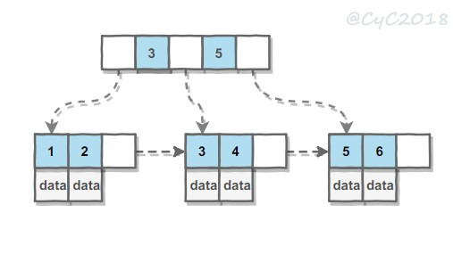

B Tree 指的是 Balance Tree，也就是平衡树 

B+ Tree 是基于 B Tree 和叶子节点顺序访问指针进行实现，它具有 B Tree 的平衡性，并且通过顺序访问指针来提高区间查询的性能。 

 

索引是在存储引擎层实现 

mysql数据数据表的排序规则修改
https://blog.csdn.net/privateobject/article/details/78363809?utm_source=blogxgwz0
MySQL定义异常和异常处理方法
https://www.cnblogs.com/geaozhang/p/6814567.html
https://blog.csdn.net/jssg_tzw/article/details/39706213
MySQL数据高级查询之连接查询、联合查询、子查询
https://blog.csdn.net/u011277123/article/details/54863371/
Mysql中用SQL增加、删除字段，修改字段名、字段类型、注释，调整字段顺序总结
https://www.cnblogs.com/wenlj/p/5258102.html
MySQL类型float double decimal的区别
https://www.cnblogs.com/gulibao/p/5416245.html
MySQL权限简介
https://blog.csdn.net/qingsong3333/article/details/76599567