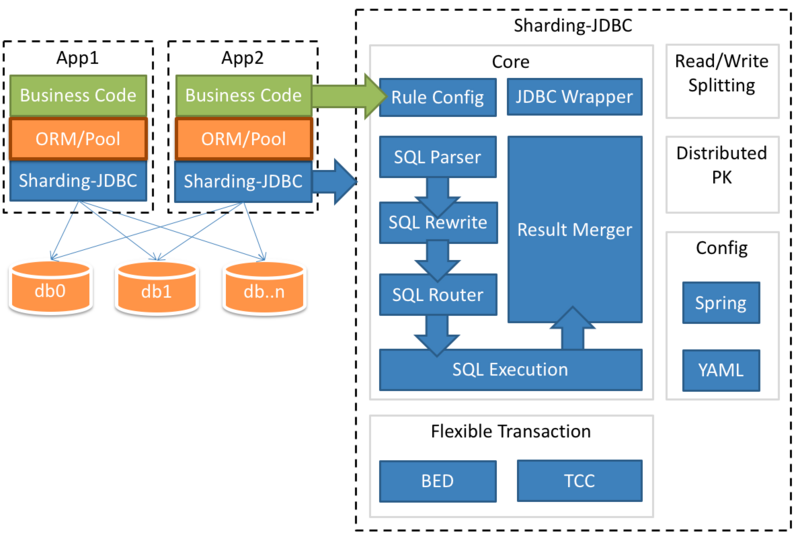
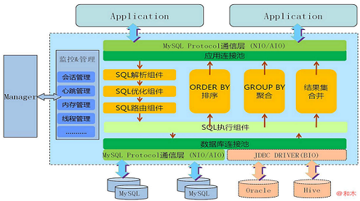

https://github.com/doocs/advanced-java/blob/master/docs/high-concurrency/database-shard.md

| #            | 分库分表前                   | 分库分表后                                   |
| ------------ | ---------------------------- | -------------------------------------------- |
| 并发支撑情况 | MySQL 单机部署，扛不住高并发 | MySQL从单机到多机，能承受的并发增加了多倍    |
| 磁盘使用情况 | MySQL 单机磁盘容量几乎撑满   | 拆分为多个库，数据库服务器磁盘使用率大大降低 |
| SQL 执行性能 | 单表数据量太大，SQL 越跑越慢 | 单表数据量减少，SQL 执行效率明显提升         |

- cobar
- TDDL
- atlas
- sharding-jdbc
- mycat

sharding-jdbc 这种 client 层方案的**优点在于不用部署，运维成本低，不需要代理层的二次转发请求，性能很高**，但是如果遇到升级啥的需要各个系统都重新升级版本再发布，各个系统都需要**耦合** sharding-jdbc 的依赖；

 

mycat 这种 proxy 层方案的**缺点在于需要部署**，自己运维一套中间件，运维成本高，但是**好处在于对于各个项目是透明的**，如果遇到升级之类的都是自己中间件那里搞就行了。

 

