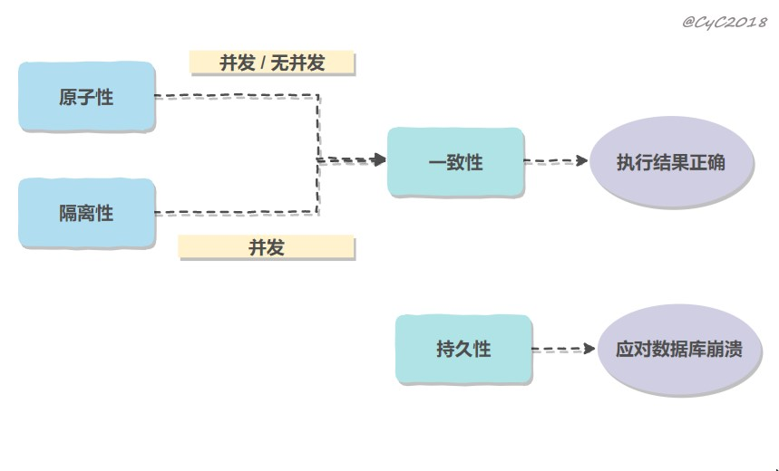

https://github.com/CyC2018/CS-Notes/blob/master/docs/notes/%E6%95%B0%E6%8D%AE%E5%BA%93%E7%B3%BB%E7%BB%9F%E5%8E%9F%E7%90%86.md

 

 

MySQL 默认采用自动提交模式。也就是说，如果不显式使用`START TRANSACTION`语句来开始一个事务，那么每个查询都会被当做一个事务自动提交。 

