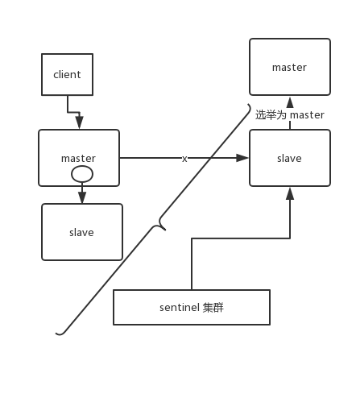

why

缓存

高性能：需要复杂操作耗时查询的结果，缓存起来直接读取

高并发：mysql 2000qps，缓存几万十几万并发


存在的问题：

1. 缓存和数据库双写不一致
2. 缓存雪崩，缓存穿透
3. 缓存并发竞争


双写一致：

读请求和写请求串行化到内存队列中，吞吐量大幅度降低


缓存+数据库读写模式：Cache Aside Pattern

1. 读，先读取缓存，缓存没有，读数据库，取出数据放入缓存，同时返回数据
2. 更新，先更新数据库，再删除缓存（注意不是更新缓存，用到才去缓存，懒加载）


问题：先更新数据库，再删除缓存。如果删除缓存失败了，那么会导致数据库中是新数据，缓存中是旧数据，数据就出现了不一致。 

- 先删缓存，即使数据库里更新失败了，缓存没有值，就不存在不一致问题


问题：数据发生了变更，先删除了缓存，然后要去修改数据库，此时还没修改。一个请求过来，去读缓存，发现缓存空了，去查询数据库，**查到了修改前的旧数据**，放到了缓存中。随后数据变更的程序完成了数据库的修改。 

高并发场景下出现

解决方案：

更新数据的时候，根据**数据的唯一标识**，将操作路由之后，发送到一个 jvm 内部队列中。读取数据的时候，如果发现数据不在缓存中，那么将重新读取数据+更新缓存的操作，根据唯一标识路由之后，也发送同一个 jvm 内部队列中。

一个队列对应一个工作线程，每个工作线程**串行**拿到对应的操作，然后一条一条的执行。这样的话，一个数据变更的操作，先删除缓存，然后再去更新数据库，但是还没完成更新。此时如果一个读请求过来，没有读到缓存，那么可以先将缓存更新的请求发送到队列中，此时会在队列中积压，然后同步等待缓存更新完成。


缓存雪崩

缓存故障，或者大面积失效，所有请求都到了数据库

解决方案：

- 事前：redis 高可用，主从+哨兵，redis cluster，避免全盘崩溃。
- 事中：本地 ehcache 缓存 + hystrix 限流&降级，避免 MySQL 被打死。
- 事后：redis 持久化，一旦重启，自动从磁盘上加载数据，快速恢复缓存数据。

 

缓存穿透

查询根本不存在的数据，比如id为负数的


解决方案：

数据库第一次查不到，就在缓存中放一个空值，设定过期时间


缓存击穿

某个热点key突然失效的时候

解决方案：

热点数据设置为不过期

基于redis或者zookeeper的互斥锁，等第一个请求更新完缓存之后，再释放其他请求


缓存并发

redis事务的CAS方案

多客户端同时并发写同一个key

使用分布式锁


数据都要保留时间戳


## redis线程模型

文件事件处理器 file event handler 单线程

IO多路复用同时监听多个socket，产生事件的socket压入内存队列，事件分派器根据socket的事件类型选择对应的事件处理器进行处理


文件事件处理器的结构包含 4 个部分：

- 多个 socket
- IO 多路复用程序
- 文件事件分派器
- 事件处理器（连接应答处理器、命令请求处理器、命令回复处理器）


 

- 纯内存操作
- 核心是基于非阻塞的 IO 多路复用机制
- 单线程反而避免了多线程的频繁上下文切换问题


## redis数据类型

key都是string类型

value有5种：

- string
- hash
- list
- set
- sorted set


## redis过期策略

定期删除+惰性删除

定期：

redis 默认是每隔 100ms 就随机抽取一些设置了过期时间的 key，检查其是否过期，如果过期就删除 

redis 是每隔 100ms **随机抽取**一些 key 来检查和删除的 

惰性：

获取 key 的时候，如果此时 key 已经过期，就删除，不会返回任何东西。 

内存淘汰机制

- noeviction: 当内存不足以容纳新写入数据时，新写入操作会报错，这个一般没人用吧，实在是太恶心了。
- **allkeys-lru**：当内存不足以容纳新写入数据时，在**键空间**中，移除最近最少使用的 key（这个是**最常用**的）。
- allkeys-random：当内存不足以容纳新写入数据时，在**键空间**中，随机移除某个 key，这个一般没人用吧，为啥要随机，肯定是把最近最少使用的 key 给干掉啊。
- volatile-lru：当内存不足以容纳新写入数据时，在**设置了过期时间的键空间**中，移除最近最少使用的 key（这个一般不太合适）。
- volatile-random：当内存不足以容纳新写入数据时，在**设置了过期时间的键空间**中，**随机移除**某个 key。
- volatile-ttl：当内存不足以容纳新写入数据时，在**设置了过期时间的键空间**中，有**更早过期时间**的 key 优先移除。


手写LRU

```java
class LRUCache<K,V> extends LinkedHashMap<K,V> {
    private final int CACHE_SIZE;
    
    public LRUCache(int size) {
        // true 表示让 linkedHashMap 按照访问顺序来进行排序，最近访问的放在头部，最老访问的放在尾部。
        super((int) Math.ceil(size/0.75)+1,0.75f,true);
        CACHE_SIZE=size;
    }
    
    protected boolean removeEldestEntry(Map.Entry<K,V> eldest) {
        // 当 map中的数据量大于指定的缓存个数的时候，就自动删除最老的数据。
        return size() > CACHE_SIZE;
    }
}
```


## redis高并发高可用

高并发：主从架构，大量数据使用集群

高可用：主从+哨兵


主从：

一主多从，主负责写入，从负责读取10wQPS

 

必须开始master node的持久化


主从复制核心原理

 

RDB+缓存的写命令

断点续传

RDB支持在内存中直接创建

salve node的key不会过期，由master node模拟发送del命令


完整流程

 


高可用

sentinel，哨兵

- 集群监控：负责监控 redis master 和 slave 进程是否正常工作。
- 消息通知：如果某个 redis 实例有故障，那么哨兵负责发送消息作为报警通知给管理员。
- 故障转移：如果 master node 挂掉了，会自动转移到 slave node 上。
- 配置中心：如果故障转移发生了，通知 client 客户端新的 master 地址。


哨兵集群

- 故障转移时，判断一个 master node 是否宕机了，需要大部分的哨兵都同意才行，涉及到了分布式选举的问题。
- 即使部分哨兵节点挂掉了，哨兵集群还是能正常工作的。


注意：

1. 哨兵实例至少3个
2. 只保证高可用，不保证数据0丢失
3. 需要充分测试和演练


哨兵主备切换导致数据丢失

1. 异步复制导致
2. 脑裂问题导致

 


 


解决方案：


配置

```
min-slaves-to-write 1
min-slaves-max-lag 10
```


哨兵其他基础


## redis持久化

RDB 周期性持久化数据

AOF 命令日志

同时开启


## redis集群工作模式

- 自动将数据进行分片，每个 master 上放一部分数据
- 提供内置的高可用支持，部分 master 不可用时，还是可以继续工作的


每个节点开放2个端口：

6379 提供服务端口

16379 节点间通信，故障检测，配置更新，故障转移授权，gossip协议


分布式寻址算法

重要

1. hash算法（大量缓存重建）
2. 一致性hash算法（自动缓存迁移）+虚拟节点（自动负载均衡）
3. redis cluster的hash slot算法


hash算法：

key，取hash值，对节点数取模

节点宕机，大量请求打到数据库


一致性hash算法：

hash值空间组织成虚拟圆环，顺时针

对master节点（服务器ip或者主机名）取hash，确定其在hash环上的位置


节点太少，分布不均匀，某些节点会缓存大量数据

对每个节点计算多个hash，虚拟节点

 


redis cluster - hash slot

16384个hash slot

key 计算CRC16值，对16384取模，得到key的hash slot

 


 


