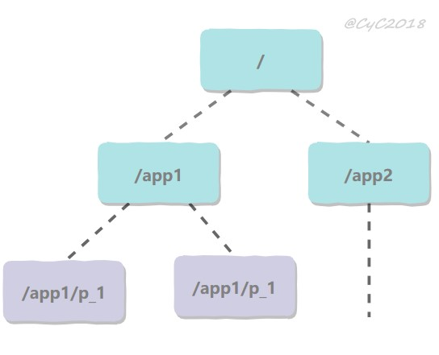
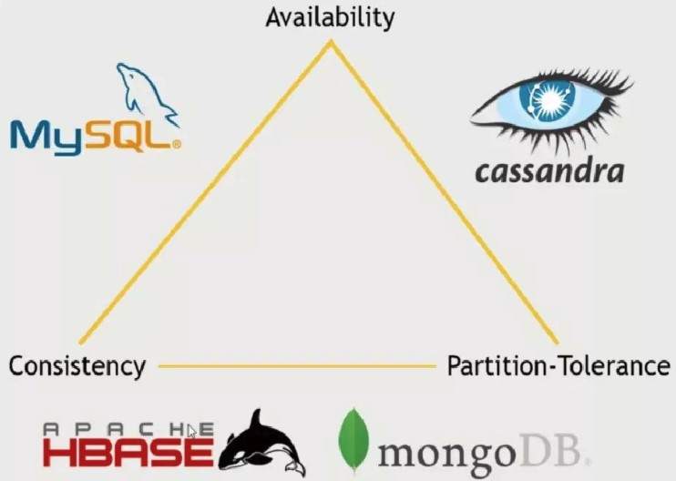

分布式锁

获得锁时向表中插入一条记录，释放锁时删除这条记录 

唯一索引可以保证该记录只被插入一次 

Redis 的 SETNX 指令

SETNX（set if not exist）指令插入一个键值对 

如果 Key 已经存在，那么会返回 False，否则插入成功并返回 True 

EXPIRE 指令可以为一个键值对设置一个过期时间，从而避免了数据库唯一索引实现方式中释放锁失败的问题 

zk

 

- 永久节点：不会因为会话结束或者超时而消失；
- 临时节点：如果会话结束或者超时就会消失；
- 有序节点：会在节点名的后面加一个数字后缀，并且是有序的，例如生成的有序节点为 /lock/node-0000000000，它的下一个有序节点则为 /lock/node-0000000001，以此类推。

- 创建一个锁目录 /lock；
- 当一个客户端需要获取锁时，在 /lock 下创建临时的且有序的子节点；
- 客户端获取 /lock 下的子节点列表，判断自己创建的子节点是否为当前子节点列表中序号最小的子节点，如果是则认为获得锁；否则监听自己的前一个子节点，获得子节点的变更通知后重复此步骤直至获得锁；
- 执行业务代码，完成后，删除对应的子节点。

参考推特实现

分布式事务

事务的操作位于不同的节点上 

下单场景下，库存和订单如果不在同一个节点上，就涉及分布式事务 

方案

本地消息表

本地消息表与业务数据表处于同一个数据库 

 

两阶段提交（Two-phase Commit，2PC），通过引入协调者（Coordinator）来协调参与者的行为，并最终决定这些参与者是否要真正执行事务 

准备

提交

分布式系统不可能同时满足一致性（C：Consistency）、可用性（A：Availability）和分区容忍性（P：Partition Tolerance），最多只能同时满足其中两项 

 

分布式系统中，分区容忍性必不可少，因为需要总是假设网络是不可靠的 

- 为了保证一致性（CP），不能访问未同步完成的节点，也就失去了部分可用性；
- 为了保证可用性（AP），允许读取所有节点的数据，但是数据可能不一致。

基本可用（Basically Available）、软状态（Soft State）和最终一致性（Eventually Consistent） 

对 CAP 中一致性和可用性权衡的结果，它的核心思想是：即使无法做到强一致性，但每个应用都可以根据自身业务特点，采用适当的方式来使系统达到最终一致性 

分布式一致性协议 

Paxos

对多个节点产生的值，该算法能保证只选出唯一一个值 

- 提议者（Proposer）：提议一个值；
- 接受者（Acceptor）：对每个提议进行投票；
- 告知者（Learner）：被告知投票的结果，不参与投票过程。

 

规定一个提议包含两个字段：[n, v]，其中 n 为序号（具有唯一性），v 为提议值 

prepare->accept->learn

raft

分布式一致性协议，主要是用来竞选主节点 

三种节点：Follower、Candidate 和 Leader 

