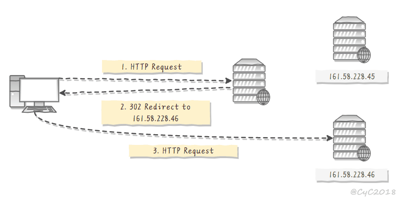
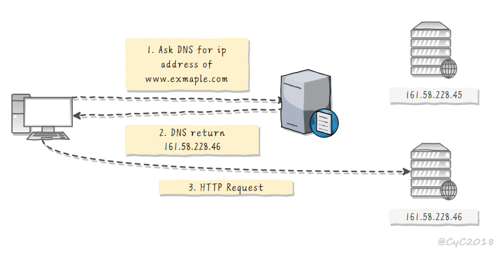

算法

Round Robin

轮询算法把每个请求轮流发送到每个服务器上 

适合每个服务器的性能差不多的场景 

Weighted Round Robbin

根据服务器的性能差异，为服务器赋予一定的权值，性能高的服务器分配更高的权值 

least Connections

将请求发送给当前最少连接数的服务器上 

Weighted Least Connection

在最少连接的基础上，根据服务器的性能为每台服务器分配权重，再根据权重计算出每台服务器能处理的连接数 

Random

适合服务器性能差不多的场景

IP Hash

保证同一 IP 的客户端的请求会转发到同一台服务器上，用来实现会话粘滞（Sticky Session）

转发

http302-不用

 

域名解析的结果为内部的负载均衡服务器 IP 地址 - 一级负载均衡

 

反向代理服务器 

客户端不直接请求源服务器 

反向代理需要配置内部和外部两套 IP 地址 

网络层

操作系统内核进程获取网络数据包，根据负载均衡算法计算源服务器的 IP 地址，并修改请求数据包的目的 IP 地址，最后进行转发 

链路层-主用

链路层根据负载均衡算法计算源服务器的 MAC 地址，并修改请求数据包的目的 MAC 地址，并进行转发 

配置源服务器的虚拟 IP 地址和负载均衡服务器的 IP 地址一致，从而不需要修改 IP 地址就可以进行转发 

源服务器的响应不需要转发回负载均衡服务器，可以直接转发给客户端，避免了负载均衡服务器的成为瓶颈 

