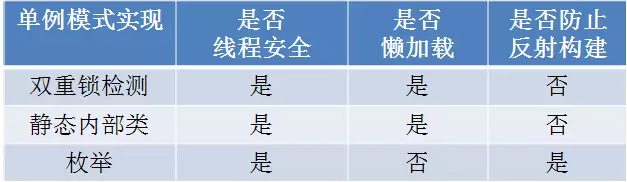

https://mp.weixin.qq.com/s?__biz=MzIxMjE5MTE1Nw==&mid=2653192251&idx=2&sn=4acce2985ab4fcc908235891c9213628&chksm=8c99f2e1bbee7bf7f64132bb58d3023f79b3c11fe2043dcd29fe07f4ddb5b3c7d375252d8555&scene=21#wechat_redirect

https://github.com/CyC2018/CS-Notes/blob/master/notes/%E8%AE%BE%E8%AE%A1%E6%A8%A1%E5%BC%8F.md#1-%E5%8D%95%E4%BE%8Bsingleton

一个类只有一个实例，并提供该实例的全局访问
一个私有构造函数、一个私有静态变量以及一个公有静态函数
私有构造函数保证了不能通过构造函数来创建对象实例
公有静态函数返回唯一的私有静态变量

实现方式：
1. 懒汉式：线程不安全
2. 饿汉式：线程安全，非懒加载，无法防止利用反射来重复构建对象
3. 双重锁检测：线程安全，无法防止利用反射来重复构建对象
4. 静态内部类：线程安全，无法防止利用反射来重复构建对象
5. 枚举实现：单例对象在枚举类被加载的时候初始化，非懒加载，线程安全

1. volatile关键字不但可以防止指令重排，也可以保证线程访问的变量值是**主内存中的最新值**。
2. 使用枚举实现的单例模式，不但可以防止利用反射强行构建单例对象，而且可以在枚举类对象被**反序列化**的时候，保证反序列的返回结果是同一对象。

对于其他方式实现的单例模式，如果既想要做到可序列化，又想要反序列化为同一对象，则必须实现**readResolve**方法。

 