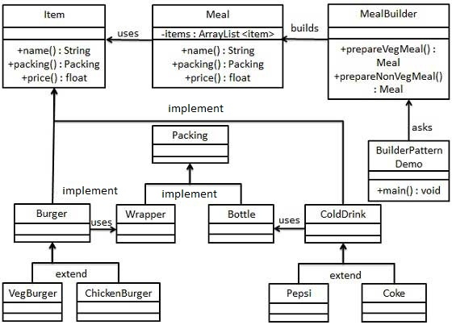

封装一个对象的构造过程，并允许按步骤构造。 

StringBuilder

 

建造者模式，又称生成器模式：将一个复杂的构建与其表示相分离，使得同样的构建过程可以创建不同的表示。

三个角色：**建造者**、**具体的建造者**、**监工**、**使用者（严格来说不算）**

-  **建造者角色**：定义生成实例所需要的所有方法；
-  **具体的建造者角色**：实现生成实例所需要的所有方法，并且定义获取最终生成实例的方法；
-  **监工角色**：定义使用建造者角色中的方法来生成实例的方法；
-  **使用者**：使用建造者模式。

> **注意**：定义中“**将一个复杂的构建过程与其表示相分离**”，表示并不是由建造者负责一切，而是由监工负责控制（定义）一个复杂的构建过程，由各个不同的建造者分别负责实现构建过程中所用到的所有构建步骤。不然，就无法做到“使得同样的构建过程可以创建不同的表示”这一目标。
>
> 